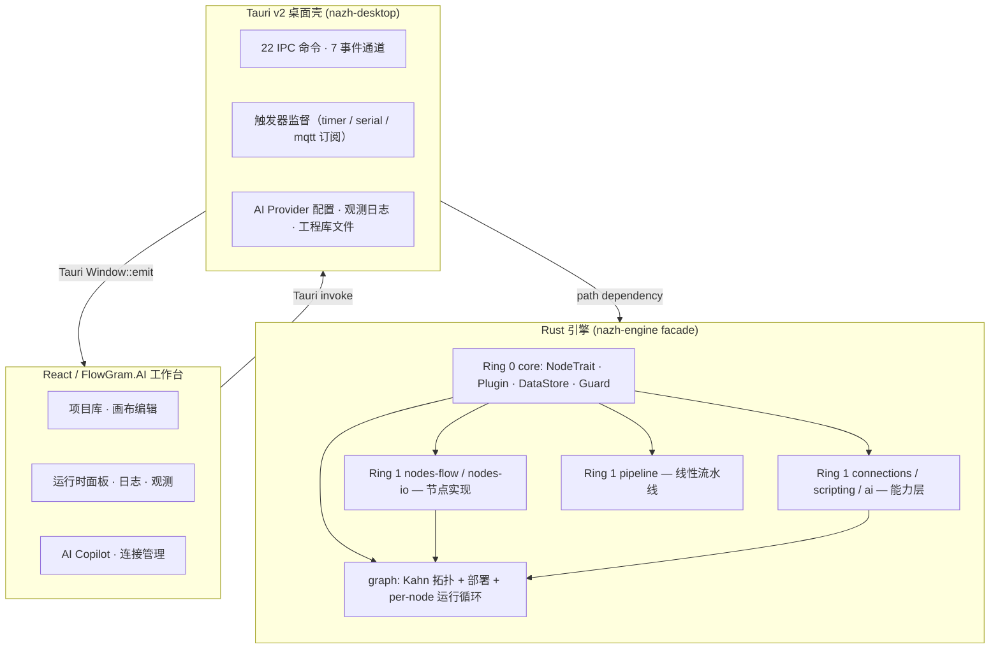

<p align="center">
  
</p>

<h1 align="center">Nazh</h1>

<p align="center">
  <a href="https://github.com/ssXue/Nazh/actions/workflows/ci.yml">
    
  </a>
  <a href="https://github.com/ssXue/Nazh/blob/main/LICENSE">
    
  </a>
  <a href="https://github.com/ssXue/Nazh/stargazers">
    
  </a>
  <a href="https://www.rust-lang.org/">
    
  </a>
  <a href="https://tauri.app/">
    
  </a>
  <a href="https://react.dev/">
    
  </a>
  <a href="https://github.com/bytedance/flowgram.ai">
    
  </a>
</p>

<p align="center">
  <code>工业边缘工作流编排引擎</code> · <code>AI 驱动</code> · <code>Rust + Tauri + React</code>
</p>

> 面向工业边缘的本地工作流编排引擎。Rust 可靠内核 + Tauri 桌面壳 + React/FlowGram.AI 可视化工作台。AI 能力（脚本生成、工作流辅助、思考模式推理）作为一等公民集成到执行引擎中。

## 项目定位

Nazh 面向**工业边缘侧的本地部署**场景：

- **DAG 编排**：把设备采集、协议动作、数据清洗、条件分支、脚本逻辑组织成可执行的有向无环图
- **可靠执行**：节点级超时、panic 隔离、失败事件回传；单节点异常不拖垮运行时
- **AI 增强**：内置 OpenAI 兼容客户端 + 流式输出 + 思考模式；`code` 节点支持自然语言生成 Rhai 脚本；脚本运行时可调用 `ai_complete()`
- **类型契约**：Rust 侧统一定义 IPC 边界类型，`ts-rs` 自动生成 TypeScript，编译期杜绝前后端漂移
- **本地优先**：单进程 Tauri 桌面部署，零网络依赖，适合边缘节点与离线环境

典型数据流：`FlowGram 画布 → Workflow AST → Tauri IPC → Rust DAG → 执行事件回流 → 工作台`

## 工程架构

### Cargo Workspace（8 个 crate）

```
crates/
├── core/              # Ring 0 — 引擎内核（NodeTrait / Plugin / DataStore / EventChannel）
├── pipeline/          # Ring 1 — 线性流水线抽象
├── connections/       # Ring 1 — 连接资源池 + RAII Guard + 熔断/限流
├── scripting/         # Ring 1 — Rhai 脚本引擎（含 ai_complete() 桥）
├── nodes-flow/        # Ring 1 — 流程节点：if / switch / loop / tryCatch / code
├── nodes-io/          # Ring 1 — I/O 节点：timer / serial / modbus / http / mqtt / bark / sql / debug
└── ai/                # Ring 1 — AiService trait + OpenAI 兼容客户端（流式 / 思考模式 / DeepSeek）

src/                   # nazh-engine facade — DAG 编排 + standard_registry()
src-tauri/             # Tauri 桌面壳（nazh-desktop）
web/                   # React + FlowGram.AI 工作台
```

Ring 0/1 分层规则与设计哲学见 [`AGENTS.md`](./AGENTS.md) 与 [`docs/rfcs/0002-分层内核与插件架构.md`](./docs/rfcs/0002-分层内核与插件架构.md)。

### 三层架构



### 数据与控制分离

- **Payload（业务数据）** 走 `DataStore`（`ArenaDataStore` 内存默认实现），通过 `ContextRef`（~64 字节）在 MPSC 通道传递
- **Metadata（执行元数据：协议参数、连接信息、触发时刻）** 走 `ExecutionEvent::Completed` 事件通道，**不污染 payload**
- **Configuration（未来共享状态）** 将通过 `WorkflowVariables` 承载（ADR-0012，提议中）

详见 [ADR-0008](./docs/adr/0008-节点输出元数据通道.md) 与 [ADR-0012](./docs/adr/0012-工作流变量.md)。

## 节点能力

### 触发器节点
| 节点 | 功能 |
|------|------|
| `timer` | 定时触发，支持立即/延迟首触 |
| `serialTrigger` | 串口帧监听（依赖 connection 层借出串口资源） |
| `mqttClient`（订阅） | MQTT 订阅触发（当前由壳层管理生命周期，ADR-0009 待迁入引擎） |

### 流程节点
| 节点 | 功能 |
|------|------|
| `if` | 布尔条件二选一 |
| `switch` | 多路径由（Rhai 表达式求值） |
| `tryCatch` | 异常捕获路由（try / catch 端口） |
| `loop` | 迭代循环（默认上限 10k，可配） |
| `code` | Rhai 沙箱脚本；支持 AI 生成 + 思考模式 |

### I/O 节点
| 节点 | 功能 |
|------|------|
| `native` | 原生字段注入 / 透传 |
| `modbusRead` | Modbus TCP 真实驱动（寄存器读取） |
| `httpClient` | HTTP 请求（内置钉钉 Webhook 模板） |
| `mqttClient`（发布） | MQTT 单次发布 |
| `barkPush` | Bark iOS 推送 |
| `sqlWriter` | SQLite 本地持久化（bundled） |
| `debugConsole` | 格式化调试输出 |

### 新增节点

1. 在 `crates/nodes-flow/` 或 `crates/nodes-io/` 下新建 `src/<node>.rs`，实现 `NodeTrait`
2. 定义 `*Config` 结构体（支持 `serde::Deserialize`）
3. 在对应 crate 的 `lib.rs` 的 `Plugin::register` 中注册工厂
4. 在前端 `web/src/components/flowgram/flowgram-node-library.ts` 增加节点定义
5. 在 `tests/workflow.rs` 添加最小 DAG 的集成测试

注意事项详见 [AGENTS.md](./AGENTS.md) 的 "Critical Coding Constraints" 小节。

## AI 能力

`ai` crate 提供统一的 `AiService` trait + OpenAI 兼容 HTTP 客户端（含 Azure、DeepSeek、Moonshot 等）：

- **流式补全**：SSE 流式返回 token，UI 可逐字渲染
- **思考模式**：支持 reasoning effort（low/medium/high）与 DeepSeek `<thinking>` 标签解析
- **`code` 节点 AI 生成**：用户输入自然语言需求 → 生成 Rhai 脚本插入节点
- **脚本内调用**：Rhai 脚本可直接调 `ai_complete(prompt)` 获取结构化 JSON 结果
- **Provider 管理**：Tauri 命令 `list_ai_providers` / `save_ai_provider` / `test_ai_provider`，磁盘 atomic 写入

ADR-0019 规划了把 `AiService` trait 上移到 Ring 0、`ai` crate 重定位为"OpenAI 兼容实现"的依赖反转方案——未来接入 Claude 原生 SDK、本地 Llama、通义千问等只需新 crate 实现 trait。

## 连接治理

`ConnectionManager` 是引擎中**唯一的共享可变状态**：

- **RAII 借出**：节点通过 `ConnectionGuard` 借出资源，Drop 时自动释放——即使节点 panic 也不会泄漏
- **限流**：每个连接可配置最大并发借出数
- **熔断器**：连续失败超阈值自动熔断，指数退避恢复
- **健康状态机**：10 种状态（就绪/忙/熔断/无效配置/...）+ 诊断建议
- **细粒度锁**：按连接 ID 分片的 sync Mutex（避免全局 RwLock 竞争），见 ADR-0005

## 运行时能力

### 多工作流并发
Tauri 壳支持同时部署多个工作流：
- **作用域事件** `workflow://node-status` / `workflow://result` 携带 `workflow_id` 区分
- **活动工作流切换** `set_active_runtime_workflow` 命令
- **运行时摘要** `list_runtime_workflows` 查询

### 派发路由 & 背压
`dispatch_payload` 内置**背压策略 + 重试 + 死信队列**，三种派发源：
- 前端手动派发
- 定时器 tick
- 外部触发（串口帧 / MQTT 消息）

### 可观测性
`ObservabilityStore` 基于 JSONL 本地记录：
- 每节点 Started / Completed / Failed / Output 事件
- 部署/派发/卸载审计
- 告警记录（熔断、失败等）
- `query_observability` 命令按 trace / 节点 / 时间范围查询

### 部署持久化
- 部署会话 JSONL 磁盘持久化，重启恢复
- 看板文件 (`boards/*.nazh-board.json`) 与连接定义 (`connections.json`) 独立文件

## 快速开始

### 环境要求
- Rust stable（工具链见 `rust-toolchain.toml`，当前 1.94）
- Node.js 20+ / npm
- macOS: Xcode Command Line Tools；Linux: 系统 WebKit2GTK；Windows: WebView2

### 启动

```bash
# 1. 安装前端依赖
npm --prefix web install

# 2. 启动桌面开发版（Vite 自动启动于 1420 端口）
cd src-tauri && ../web/node_modules/.bin/tauri dev --no-watch
```

### 验证

```bash
cargo test --workspace              # 全部 Rust 测试
cargo clippy --workspace --all-targets -- -D warnings
cargo fmt --all -- --check
npm --prefix web run test           # 前端单元测试
npm --prefix web run build          # 前端构建
```

## 开发命令

| 目标 | 命令 |
|------|------|
| Workspace 测试 | `cargo test --workspace` |
| 单测试 | `cargo test <test_name>` |
| 壳层编译检查 | `cargo check --manifest-path src-tauri/Cargo.toml` |
| 前端单元测试 | `npm --prefix web run test` |
| 前端 E2E | `npm --prefix web run test:e2e` |
| 前端构建 | `npm --prefix web run build` |
| 导出 ts-rs 类型 | `cargo test --workspace --lib export_bindings` |
| 代码格式 | `cargo fmt --all` |
| Clippy | `cargo clippy --workspace --all-targets -- -D warnings` |
| 依赖审计 | `cargo deny check` |
| 运行示例 | `cargo run --example phase1_demo` |
| 生成 rustdoc | `cargo doc --no-deps --open` |

## 仓库结构

```
.
├── crates/                          # Ring 0 + Ring 1 库
│   ├── core/                        #   Ring 0 引擎内核
│   ├── pipeline/                    #   线性流水线
│   ├── connections/                 #   连接资源池
│   ├── scripting/                   #   Rhai 引擎 + AI 桥
│   ├── nodes-flow/                  #   if/switch/loop/tryCatch/code
│   ├── nodes-io/                    #   timer/serial/modbus/http/mqtt/bark/sql/debug
│   └── ai/                          #   AiService + OpenAI 兼容客户端
├── src/                             # nazh-engine facade crate
│   ├── lib.rs                       #   re-export + standard_registry()
│   ├── registry.rs                  #   工厂注册聚合
│   └── graph/                       #   DAG 编排
│       ├── types.rs                 #     WorkflowGraph / WorkflowEdge
│       ├── topology.rs              #     Kahn 算法 + 环检测
│       ├── deploy.rs                #     deploy_workflow[_with_ai]()
│       └── runner.rs                #     per-node run loop
├── src-tauri/                       # Tauri 桌面壳
│   └── src/
│       ├── main.rs
│       ├── lib.rs                   #   ~22 IPC 命令 + 触发器监督
│       └── observability.rs         #   JSONL 事件存储
├── web/                             # 前端工作台
│   └── src/
│       ├── generated/               #   ts-rs 自动生成（勿手改）
│       ├── lib/                     #   业务逻辑库
│       ├── hooks/                   #   自定义 React hooks
│       ├── components/              #   UI 组件
│       ├── styles/                  #   拆分后的样式表
│       └── App.tsx
├── tests/                           # Rust 集成测试
│   ├── pipeline.rs
│   └── workflow.rs
├── docs/
│   ├── adr/                         # 20 条架构决策记录（ADR-0001 ~ 0020）
│   ├── rfcs/                        # RFC：节点插件化、分层内核
│   ├── superpowers/
│   │   ├── plans/                   #   实施计划
│   │   └── specs/                   #   设计规格
│   └── screenshots/
├── examples/                        # 可执行示例
├── AGENTS.md                        # 贡献者与 AI 助手指引（单一事实源）
├── CLAUDE.md                        # 软链接 → AGENTS.md（Claude Code 工具找得到）
└── README.md                        # 本文件
```

## 设计原则 & 协作约定

完整的设计原则、编码约束、文档规则、Git/ADR/RFC/Review 流程和团队协作约定请阅读 [**`AGENTS.md`**](./AGENTS.md)（`CLAUDE.md` 是它的软链接，供 Claude Code / OpenCode / Cursor 等工具识别）。以下是三条最重要的：

1. **Ring 0 不含协议**。Ring 0（`crates/core/`）不依赖 `reqwest`/`rumqttc`/`rusqlite`/`tokio-modbus` 等任何协议栈。
2. **元数据不入 payload**。节点执行元数据通过 `NodeOutput::metadata` + `NodeExecution::with_metadata()` 返回，Runner 将其合并到 `ExecutionEvent::Completed` 事件。业务 payload 只装业务数据。
3. **禁 `unwrap()` / `expect()` / `unsafe`**。所有错误通过 `Result<T, EngineError>` 传播；`unsafe_code = "forbid"`、`clippy::unwrap_used = "deny"`、`clippy::expect_used = "deny"` 在 workspace 级别强制。

## 架构决策记录（ADR）

已有 20 条 ADR，完整列表见 [`docs/adr/README.md`](./docs/adr/README.md)。节选：

| ADR | 主题 | 状态 |
|-----|------|------|
| [0001](./docs/adr/0001-tokio-mpsc-dag-调度.md) | Tokio MPSC DAG 调度 | 已接受 |
| [0002](./docs/adr/0002-rhai-作为脚本引擎.md) | Rhai 作为脚本引擎 | 已接受 |
| [0003](./docs/adr/0003-tauri-ipc-不用-http.md) | Tauri IPC 而非 HTTP | 已接受 |
| [0005](./docs/adr/0005-连接管理器细粒度锁.md) | 连接管理器细粒度锁 | 已接受 |
| [0007](./docs/adr/0007-ts-rs-前后端类型契约守卫.md) | ts-rs 类型契约守卫 | 已实施 |
| [0008](./docs/adr/0008-节点输出元数据通道.md) | 节点输出元数据通道 | 已接受 |
| [0009](./docs/adr/0009-节点生命周期钩子.md) | 节点生命周期钩子 + RAII | 提议中 |
| [0010](./docs/adr/0010-pin-声明系统.md) | Pin 声明系统 | 提议中 |
| [0011](./docs/adr/0011-节点能力标签.md) | 节点能力标签 | 提议中 |
| [0012](./docs/adr/0012-工作流变量.md) | 工作流变量 | 提议中 |
| [0013](./docs/adr/0013-子图与宏系统.md) | 子图与宏系统 | 提议中 |
| [0014](./docs/adr/0014-执行边与数据边分离.md) | 执行/数据边分离 | 提议中 |
| [0015](./docs/adr/0015-反应式数据引脚.md) | 反应式数据引脚 | 提议中 |
| [0016](./docs/adr/0016-边级可观测性.md) | 边级可观测性 | 提议中 |
| [0017](./docs/adr/0017-ipc-与-ts-rs-导出归宿.md) | IPC / ts-rs 从 Ring 0 迁出 | 提议中 |
| [0018](./docs/adr/0018-nodes-io-按协议-feature-门控.md) | nodes-io 按协议 feature 门控 | 提议中 |
| [0019](./docs/adr/0019-ai-能力依赖反转.md) | AI 能力依赖反转 | 提议中 |
| [0020](./docs/adr/0020-graph-编排层长期归属.md) | graph 编排层归属（评估） | 提议中 |

## 当前限制与路线图

### 已完成
- ✅ Rust 2024 + Cargo workspace（Phase 1-5）
- ✅ Plugin 系统 + NodeRegistry，零硬编码节点
- ✅ Control/Data plane 分离（ADR-0008）
- ✅ Modbus TCP / MQTT / Bark 真实驱动
- ✅ AI 流式输出 + 思考模式 + DeepSeek 集成
- ✅ 多工作流并发运行时 + 死信队列 + 背压
- ✅ 部署持久化 + 重启恢复
- ✅ 前端样式模块化（11 个子样式表替代 8500 行单文件）

### 进行中 / 近期
- 🚧 节点生命周期钩子（ADR-0009）→ 把 MQTT/Timer/Serial 从壳层迁回引擎
- 🚧 Pin 声明系统（ADR-0010）→ 类型化端口 + 部署期 DAG 校验
- 🚧 IPC / ts-rs 迁出 Ring 0（ADR-0017）→ 新建 `crates/tauri-bindings/`

### 中期
- 节点能力标签（ADR-0011）+ 工作流变量（ADR-0012）+ 子图（ADR-0013）
- nodes-io 按协议 feature 门控（ADR-0018）
- 安全：账号体系、RBAC、凭据加密、操作审计
- 交付：安装包签名、公证、自动更新

### 长期
- 执行/数据边分离 + 反应式引脚（ADR-0014 / 0015）
- 边级可观测性（ADR-0016）+ EventBus
- WASM 插件（RFC-0002 Phase 7）
- AI 扩展：embedding 向量检索、视觉识别、语音

## 贡献

**先读 [`AGENTS.md`](./AGENTS.md)**——它是单一事实源，包含设计原则、编码约束、文档规则、Git/ADR/RFC/Review/Memory 等完整协作约定。

快速清单：
- 每个 commit 必须 `git commit -s` 带 Signed-off-by
- 代码注释、错误消息、日志消息、commit message 使用中文
- 提交前跑 `cargo test --workspace` + `cargo clippy --workspace --all-targets -- -D warnings` + `cargo fmt --all --check`
- 改动 `#[ts(export)]` 类型后跑 `cargo test --workspace --lib export_bindings` 并提交生成的 TS
- 重大架构变更先写 ADR（`docs/adr/NNNN-title.md`），可追记式（ADR-0008 即为例）

## License

MIT
