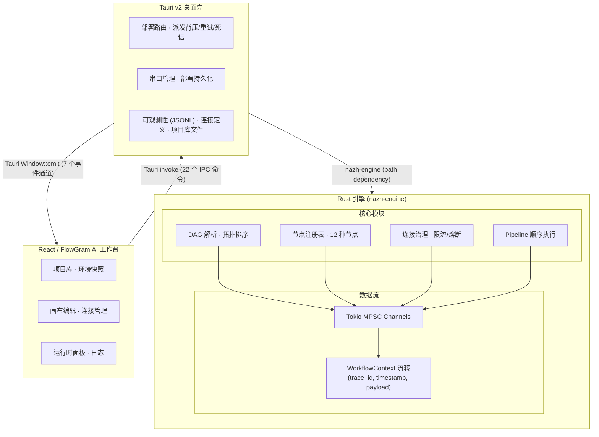

<p align="center">
  
</p>

<h1 align="center">Nazh</h1>

<p align="center">
  <a href="https://github.com/ssXue/Nazh/actions/workflows/ci.yml">
    
  </a>
  <a href="https://github.com/ssXue/Nazh/blob/main/LICENSE">
    
  </a>
  <a href="https://github.com/ssXue/Nazh/stargazers">
    
  </a>
  <a href="https://github.com/ssXue/Nazh/issues">
    
  </a>
  <a href="https://www.rust-lang.org/">
    
  </a>
  <a href="https://tauri.app/">
    
  </a>
  <a href="https://react.dev/">
    
  </a>
  <a href="https://github.com/bytedance/flowgram.ai">
    
  </a>
</p>

<p align="center">
  <code>工业边缘工作流编排引擎</code> · <code>Rust + Tauri + React / FlowGram.AI</code> · <code>12 种内置节点</code> · <code>多工作流并发运行时</code>
</p>

> 面向工业边缘场景的本地工作流编排引擎。使用 Rust 构建可靠执行内核，通过 Tauri 桌面壳与 React / FlowGram.AI 工作台完成可视化编排、部署、调试与运行观测。

## 项目概览

Nazh 是工业边缘侧的本地运行时与桌面工作台，聚焦以下核心问题：

- **DAG 编排**：将设备接入、协议动作、数据清洗、条件分支和脚本逻辑编排成可执行有向无环图。
- **可靠执行**：节点级超时保护、panic 隔离、失败事件回传，单节点异常绝不拖垮运行时。
- **类型安全 IPC**：Rust 侧统一定义边界类型，通过 `ts-rs` 自动生成 TypeScript，编译期杜绝双端漂移。
- **本地优先**：通过 Tauri 桌面壳承载工作台，适合边缘节点、实验环境和离线调试场景。

典型数据流：`FlowGram 画布 → Workflow AST(JSON) → Tauri IPC → Rust DAG Runtime → 执行事件 / 结果回流 → 桌面工作台`

## 系统架构



### 三层职责

| 层 | 职责 | 关键约束 |
|----|------|----------|
| **Rust 引擎** (`src/`) | DAG 解析、节点执行、连接治理、事件输出 | 纯库 crate，零 Tauri 依赖 |
| **Tauri 壳** (`src-tauri/`) | IPC 命令、派发路由、串口 I/O、持久化 | 桥接引擎与前端，不承载业务逻辑 |
| **前端** (`web/`) | 画布编辑、状态展示、项目管理 | 仅视图层，通过 `invoke` / `emit` 通信 |

## 节点体系

引擎内置 12 种节点，分为四大类，通过 `NodeRegistry` 工厂统一注册。所有节点实现 `NodeTrait` 异步接口，每个节点拥有独立的 `*Config` 反序列化结构体。

### 触发器节点

| 节点 | 说明 | 端口 |
|------|------|------|
| `Timer` | 定时触发，注入 `_timer` 元数据 | → 输出 |
| `SerialTrigger` | 串口帧读取与标准化 | → 输出 |

### 路由节点

| 节点 | 说明 | 端口 |
|------|------|------|
| `If` | 布尔条件分支 | → true / false |
| `Switch` | 多分支路由（Rhai 脚本求值） | → 多个输出端口 |
| `TryCatch` | 异常捕获路由 | → try / catch |
| `Loop` | 迭代循环（上限 10k 次） | → body / done |

### I/O 节点

| 节点 | 说明 | 端口 |
|------|------|------|
| `Native` | Rust 原生逻辑，字段注入 | → 输出 |
| `Rhai / Code` | 沙箱脚本执行（步数上限防死循环） | → 输出 |
| `HttpClient` | HTTP 请求，支持钉钉 Webhook | → 输出 |
| `ModbusRead` | Modbus 寄存器读取（当前为模拟） | → 输出 |
| `SqlWriter` | SQLite 持久化 | → 输出 |
| `DebugConsole` | 格式化控制台输出 | → 输出 |

### 节点开发规范

新增节点需要：

1. 在 `src/nodes/` 下创建文件，实现 `NodeTrait`（可使用 `delegate_node_base!` / `impl_node_meta!` 宏减少样板代码）。
2. 定义 `*Config` 结构体，支持 `serde` 反序列化。
3. 在 `src/graph/instantiate.rs` 的 `register_standard_nodes()` 中注册工厂。
4. 在前端 `web/src/components/flowgram/flowgram-node-library.ts` 中添加对应节点类型定义。
5. 每个节点必须保留 `ai_description` 字段。

### 辅助工具

- **`RhaiNodeBase`** — 脚本节点的通用执行骨架。
- **`with_connection`** — 从 `ConnectionManager` 借出连接并执行操作的封装。
- **`{{placeholder}}` 模板引擎** — HTTP 请求体等场景的模板渲染。

## 连接治理

`ConnectionManager` 提供完整的连接生命周期管理：

- **借出/归还**：节点通过 `ConnectionLease` 借出连接，使用完毕自动归还。
- **限流**：可配置每连接最大并发借出数。
- **熔断器**：连续失败达到阈值后自动熔断，支持指数退避恢复。
- **健康诊断**：10 种健康状态（`ConnectionHealthState`），提供诊断建议。
- **全局资源池**：`Arc<RwLock<ConnectionManager>>` 是引擎中唯一的共享可变状态。

## 运行时能力

### 多工作流并发

Tauri 壳支持同时部署多个工作流，每个工作流拥有独立的 DAG 任务树：

- **作用域事件**：`workflow://node-status-v2` 和 `workflow://result-v2` 携带 `workflow_id`，区分不同工作流的事件。
- **活动工作流切换**：`set_active_runtime_workflow` 命令切换前端焦点工作流。
- **运行时摘要**：`list_runtime_workflows` 命令获取所有运行中工作流的状态。

### 派发路由

`dispatch_payload` 支持三种派发模式：

- **手动派发**：前端直接提交载荷到活动工作流。
- **定时触发**：`Timer` 节点按间隔自动派发。
- **串口触发**：`SerialTrigger` 节点收到数据帧后触发。

派发层内置背压、重试和死信队列（`list_dead_letters`），防止过载丢失数据。

### 可观测性

`ObservabilityStore` 基于 JSONL 文件记录：

- **执行事件**：每个节点的 Started / Completed / Failed / Output 事件。
- **审计日志**：部署、派发、卸载等操作记录。
- **告警记录**：连接熔断、节点失败等异常告警。
- **Trace 查询**：`query_observability` 命令支持按工作流、节点、时间范围查询。

### 部署持久化

- 部署会话持久化到磁盘（JSONL 格式），应用重启后可恢复运行中的工作流状态。
- 项目库和连接定义分别持久化为 `project-library.json` 和 `connections.json`。

## IPC 命令

Tauri 壳暴露 22 个 IPC 命令：

### 工作流生命周期

| 命令 | 说明 |
|------|------|
| `deploy_workflow` | 部署 DAG（含连接、运行策略、可观测性上下文） |
| `dispatch_payload` | 向运行中的工作流提交载荷 |
| `undeploy_workflow` | 卸载工作流并中止触发器任务 |
| `list_node_types` | 获取已注册节点类型及别名 |
| `list_runtime_workflows` | 列出所有运行中工作流 |
| `set_active_runtime_workflow` | 切换活动工作流 |
| `list_dead_letters` | 查看死信队列 |

### 连接管理

| 命令 | 说明 |
|------|------|
| `list_connections` | 连接池快照 |
| `load_connection_definitions` | 加载连接定义 |
| `save_connection_definitions` | 保存连接定义 |

### 串口

| 命令 | 说明 |
|------|------|
| `list_serial_ports` | 枚举系统串口 |
| `test_serial_connection` | 测试串口连通性 |

### 可观测性

| 命令 | 说明 |
|------|------|
| `query_observability` | 查询事件/审计/告警/Trace |

### 部署持久化

| 命令 | 说明 |
|------|------|
| `load_deployment_session_file` | 加载部署会话 |
| `save_deployment_session_file` | 保存部署会话 |
| `remove_deployment_session_file` | 删除部署会话 |
| `clear_deployment_session_file` | 清空部署会话 |

### 项目库

| 命令 | 说明 |
|------|------|
| `load_project_library_file` | 加载项目库 |
| `save_project_library_file` | 保存项目库 |

### 事件通道

| 事件 | 方向 | 用途 |
|------|------|------|
| `workflow://node-status` | Rust → JS | 活动工作流节点状态 |
| `workflow://node-status-v2` | Rust → JS | 作用域节点状态（多工作流） |
| `workflow://result` | Rust → JS | 活动工作流结果 |
| `workflow://result-v2` | Rust → JS | 作用域结果（多工作流） |
| `workflow://deployed` | Rust → JS | 部署完成通知 |
| `workflow://undeployed` | Rust → JS | 卸载完成通知 |
| `workflow://runtime-focus` | Rust → JS | 工作流焦点切换 |

## 桌面工作台

| 面板 | 说明 |
|------|------|
| **Dashboard** | 工程数量、节点/边统计、运行态分布、会话热度、部署摘要 |
| **Boards** | 工程看板，切入具体项目画布 |
| **Project Workspace** | 节点库 + FlowGram 画布 + 运行工具栏 + 底部运行观测面板 |
| **Connection Studio** | 连接定义 CRUD、串口测试、健康状态展示、引用关系同步 |
| **Runtime Manager** | 多工作流运行时管理、死信查看、派发控制 |
| **Logs** | 可观测性日志查看、审计记录、告警浏览 |
| **Payload** | 测试载荷编辑与结果回流 |
| **Settings** | 主题、强调色、密度、动画、启动页偏好 |
| **Plugin** | 插件管理（占位） |

## 界面预览

### Dashboard


### 项目工作区


### 连接资源编辑


## 技术栈

| 层 | 技术 |
|----|------|
| 引擎 | Rust (Edition 2021) · Tokio · Serde · Rhai · Rusqlite · Reqwest |
| 桌面壳 | Tauri v2 · Serialport |
| 前端 | React 18 · TypeScript · Vite |
| 画布 | FlowGram.AI (free-layout-editor) |
| 类型契约 | ts-rs (Rust → TypeScript 自动生成) |
| 通信 | Tauri `invoke` + `Window::emit` |

## 快速开始

### 环境要求

- Node.js 20+
- npm
- Rust stable toolchain
- macOS: Xcode Command Line Tools

### 1. 安装前端依赖

```bash
npm --prefix web install
```

### 2. 启动桌面开发版

```bash
cd src-tauri && ../web/node_modules/.bin/tauri dev --no-watch
```

### 3. 验证

```bash
cargo test                                    # Rust 引擎测试 (16 个)
cargo check --manifest-path src-tauri/Cargo.toml  # 桌面壳编译
npm --prefix web run test                     # 前端单元测试 (83 个)
npm --prefix web run build                    # 前端构建
```

## 开发命令

| 目标 | 命令 |
|------|------|
| Rust 引擎测试 | `cargo test` |
| 桌面壳编译检查 | `cargo check --manifest-path src-tauri/Cargo.toml` |
| 前端单元测试 | `npm --prefix web run test` |
| 前端 E2E 测试 | `npm --prefix web run test:e2e` |
| 前端构建 | `npm --prefix web run build` |
| 导出 ts-rs 类型 | `cargo test --workspace --lib export_bindings` |
| 代码格式检查 | `cargo fmt --all -- --check` |
| Clippy 检查 | `cargo clippy --all-targets -- -D warnings` |
| 运行示例 | `cargo run --example phase1_demo` |
| 生成文档 | `cargo doc --no-deps --open` |

## 仓库结构

```
.
├── src/                        # Rust 引擎核心 (nazh-engine crate)
│   ├── lib.rs                  # Crate 根，模块声明与重导出
│   ├── context.rs              # WorkflowContext 数据载体
│   ├── event.rs                # ExecutionEvent 统一事件
│   ├── error.rs                # EngineError 18 种错误变体
│   ├── ipc.rs                  # IPC 响应类型 (DeployResponse 等)
│   ├── guard.rs                # panic 隔离 + 超时保护
│   ├── registry.rs             # NodeRegistry 节点工厂注册表
│   ├── connection.rs           # ConnectionManager 连接治理
│   ├── graph/                  # DAG 解析、校验、部署、实例化、运行
│   │   ├── types.rs            #   WorkflowGraph, WorkflowNodeDefinition, WorkflowEdge
│   │   ├── topology.rs         #   Kahn 拓扑排序、环检测
│   │   ├── deploy.rs           #   deploy_workflow() 主入口
│   │   ├── instantiate.rs      #   register_standard_nodes() 工厂注册
│   │   └── runner.rs           #   run_node() 单节点执行循环
│   ├── nodes/                  # NodeTrait 与 12 种节点实现
│   │   ├── mod.rs              #   NodeTrait 定义、辅助宏
│   │   ├── helpers.rs          #   RhaiNodeBase, with_connection 等通用工具
│   │   ├── native.rs           #   Native 原生节点
│   │   ├── rhai.rs             #   Rhai 脚本节点
│   │   ├── timer.rs            #   Timer 定时触发
│   │   ├── serial_trigger.rs   #   SerialTrigger 串口触发
│   │   ├── modbus_read.rs      #   ModbusRead 寄存器读取
│   │   ├── if_node.rs          #   If 条件分支
│   │   ├── switch_node.rs      #   Switch 多分支路由
│   │   ├── try_catch.rs        #   TryCatch 异常捕获
│   │   ├── loop_node.rs        #   Loop 迭代循环
│   │   ├── http_client.rs      #   HttpClient HTTP 请求
│   │   ├── sql_writer.rs       #   SqlWriter SQLite 持久化
│   │   ├── debug_console.rs    #   DebugConsole 控制台输出
│   │   └── template.rs         #   {{placeholder}} 模板引擎
│   └── pipeline/               # 线性 Pipeline 顺序执行
│       ├── types.rs            #   PipelineStage, build_linear_pipeline()
│       └── runner.rs           #   run_stage() 阶段执行循环
├── src-tauri/                  # Tauri 桌面壳
│   └── src/
│       ├── main.rs             # 入口
│       ├── lib.rs              # 22 个 IPC 命令、派发路由、持久化
│       └── observability.rs    # ObservabilityStore JSONL 日志
├── web/                        # React + FlowGram 前端工作台
│   └── src/
│       ├── App.tsx             # 主编排器
│       ├── types.ts            # IPC 类型重导出 + 前端扩展类型
│       ├── generated/          # ts-rs 自动生成（勿手动编辑）
│       ├── lib/                # 业务逻辑库
│       ├── hooks/              # React hooks
│       └── components/         # UI 组件
├── tests/                      # Rust 集成测试
│   ├── workflow.rs             # DAG 端到端、全部 12 种节点、连接池
│   └── pipeline.rs             # 线性管道、错误恢复、panic 隔离、超时
├── docs/                       # 文档
│   ├── adr/                    # 7 篇架构决策记录
│   ├── rfcs/                   # RFC：节点插件化
│   └── screenshots/            # 界面截图
└── examples/                   # 示例
    ├── phase1_demo.rs          # 线性管道温度转换
    └── graph_demo.rs           # DAG 工作流演示
```

### 阅读顺序

1. `README.md` — 整体定位与架构。
2. `src/` — 运行时模型、节点抽象和连接治理。
3. `src-tauri/` — 前后端 IPC 边界。
4. `web/` — FlowGram 画布、状态管理与桌面工作区。
5. `docs/adr/` — 关键架构决策背景。

## 编码规范

- **禁止 `unwrap()` / `expect()`**：`clippy::unwrap_used = "deny"` + `clippy::expect_used = "deny"`，所有错误通过 `EngineError` 传播。
- **禁止 `unsafe`**：`unsafe_code = "forbid"`。
- **panic 隔离**：所有节点执行包裹在 `AssertUnwindSafe + catch_unwind` 中。
- **硬件解耦**：节点不直连硬件，统一通过 `ConnectionManager` 借出/归还。
- **通道优先**：节点间数据流使用 Tokio MPSC 通道，`ConnectionManager` 是唯一的共享可变状态。
- **脚本步数上限**：Rhai 节点设置 `max_operations`（默认 50k），防止死循环。
- **中文注释**：所有代码注释、文档注释、错误信息、日志消息使用中文。
- **元数据与载荷分离**：节点执行元数据（定时触发、HTTP 请求、Modbus 采样、串口帧、SQLite 写入、调试输出、连接信息等）必须通过 `NodeOutput::metadata` + `with_metadata()` 返回，使用无下划线前缀的键名（如 `"timer"`、`"http"`、`"modbus"`），由 Runner 合并到 `ExecutionEvent::Completed` 事件通道独立传递，不得混入业务 payload。仅路由上下文（`_loop`、`_error`）允许保留在 payload 中。
- **NodeTrait 签名**：`transform(trace_id, payload) → NodeExecution`，节点不得接触 `DataStore`，Runner 全权负责 store 读写。

## 测试

| 类型 | 数量 | 覆盖范围 |
|------|------|----------|
| Rust 集成测试 | 16 | Pipeline 4 (线性/错误/panic/超时) + Workflow 12 (全部节点 + DAG + 连接池) |
| Rust 内联单测 | 12 | guard/registry/template |
| 前端单元测试 | 83 | 事件解析、状态归约、工作流状态、设置、图解析、布局、FlowGram 转换、项目 CRUD、部署会话 |
| E2E 测试 | 3 | 部署/卸载生命周期、错误处理、载荷派发 |

## 当前限制

- `Modbus Read` 仍为模拟实现，MQTT 驱动未实现。
- 串口触发、HTTP Client、SQL Writer 已跑通桌面链路，但重试/重连/健康检查仍在路线图中。
- 项目库持久化已完成，缺少文件锁、冲突处理和 schema migration。
- 桌面端尚未提供账号体系、RBAC、凭据加密等安全能力。
- 交付形态仍偏开发态，安装包、签名、公证、自动更新未补齐。
- Web 产物体积偏大，后续需做分包优化。

## 路线图

### P0：试点可用

- 真实 Modbus TCP/RTU 读写驱动，MQTT Pub/Sub 节点。
- Schema migration 与项目文件治理。
- 结构化日志（`tracing` 替代 `println!`），节点耗时 trace。

### P1：生产准备

- 账号体系、RBAC、凭据加密、操作审计。
- 安装包、签名、公证、升级策略。
- 协议集成测试、长稳压测、故障注入。

### P2：平台化

- 多项目、多设备、多现场的资产模型与统一元数据目录。
- 发布审批、灰度、回滚、跨环境发布。
- 节点插件化机制（`NodePlugin` trait）。

### P3：增强能力

- AI Copilot：基于 `ai_description` 的 LLM 脚本生成与节点建议。
- 设备状态记忆系统，支持历史数据查询与多时间窗口聚合。
- 行业模板库与标准化集成接口。

## 相关文档

- `CLAUDE.md` — AI 助手开发指南
- `docs/adr/` — 架构决策记录（MPSC 调度、Rhai 选型、Tauri IPC、事件模型、连接管理、节点注册、ts-rs）
- `docs/rfcs/` — RFC：节点插件化
- `CHANGELOG.md` — 版本变更记录
- `src/README.md`、`src-tauri/README.md`、`web/README.md`、`tests/README.md` — 子模块说明

## License

MIT
