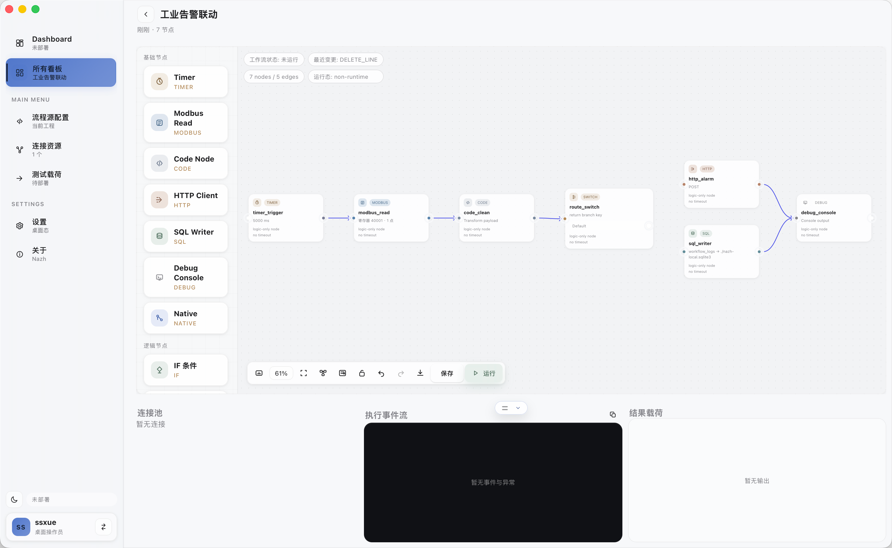
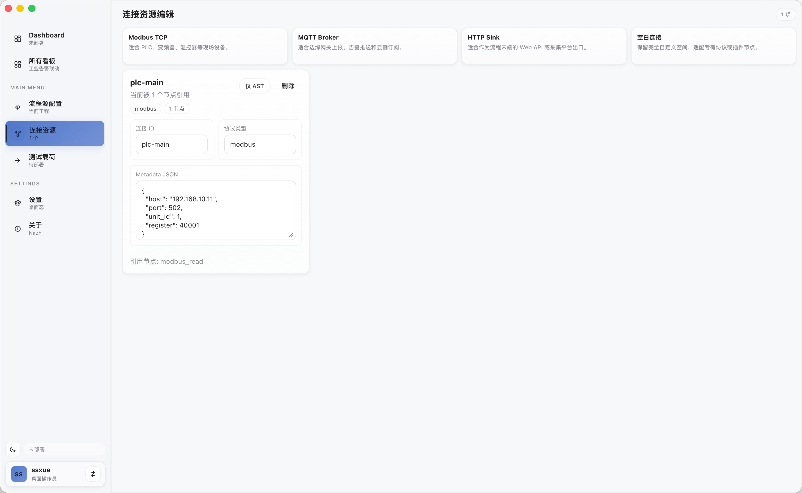
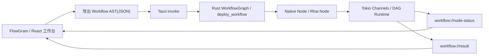

<p align="center">
  
</p>

<h1 align="center">Nazh</h1>

<p align="center">
  <a href="https://github.com/ssXue/Nazh/actions/workflows/ci.yml">
    
  </a>
  <a href="https://github.com/ssXue/Nazh/blob/main/LICENSE">
    
  </a>
  <a href="https://github.com/ssXue/Nazh/stargazers">
    
  </a>
  <a href="https://github.com/ssXue/Nazh/issues">
    
  </a>
  <a href="https://www.rust-lang.org/">
    
  </a>
  <a href="https://tauri.app/">
    
  </a>
  <a href="https://react.dev/">
    
  </a>
  <a href="https://github.com/bytedance/flowgram.ai">
    
  </a>
</p>

<p align="center">
  <code>定位：工业边缘工作流编排原型</code> · <code>状态：原型 / PoC</code> · <code>架构：Rust + Tauri + React / FlowGram.AI</code> · <code>重点：可靠执行、本地工作台、类型安全 IPC</code>
</p>

> 面向工业边缘场景的本地工作流编排原型，使用 `Rust` 构建可靠执行引擎，通过 `Tauri` 桌面壳与 `React / FlowGram.AI` 工作台完成部署、调试与运行观测。

`Nazh` 聚焦设备接入、数据转换、脚本逻辑和桌面化运维的统一编排，目标是在单机、本地网络和边缘节点环境中，提供一套轻量但可靠的工作流运行时。项目当前处于原型 / PoC 阶段，但已经打通从可视化画布到本地执行引擎，再到事件回流与结果观测的完整主链路。

## 项目概览

Nazh 不是面向通用 SaaS 场景的在线低代码平台，而是更偏工业边缘侧的本地运行时与桌面工作台组合。它关注的核心问题包括：

- 如何把设备接入、协议动作、数据清洗、条件分支和脚本逻辑编排成可执行 DAG。
- 如何在不引入中心化控制平面的前提下，完成本地部署、调试与运行观测。
- 如何在 Rust 引擎与前端工作台之间保持稳定、可验证的 IPC 类型契约。
- 如何在节点失败、超时或脚本异常时保证运行时具备足够的隔离性与可恢复性。

典型数据流为：`FlowGram 画布 -> Workflow AST(JSON) -> Tauri IPC -> Rust DAG Runtime -> 执行事件 / 结果回流 -> 桌面工作台`。

## 为什么是 Nazh

- 本地优先：通过 `Tauri` 桌面壳承载工作台，适合边缘节点、实验环境和离线调试场景。
- 可靠性优先：执行引擎基于 `Rust + Tokio`，强调节点超时保护、panic 隔离和失败事件回传。
- 编排优先：前端使用 `FlowGram.AI` 作为画布编辑器，工作流可视化与 AST 导出路径清晰。
- 类型安全优先：IPC 边界类型由 Rust 侧统一定义，通过 `ts-rs` 自动生成 TypeScript 类型，减少双端漂移。
- 演进路径清晰：当前先完成运行时骨架、桌面工作区和测试基础设施，后续再逐步接入真实工业协议与 AI 辅助能力。

## 当前成熟度

项目当前定位为透明原型期，而不是可直接投产的工业平台。当前已经明确完成并验证了以下能力：

- 已打通 `Rust 引擎 + Tauri 桌面壳 + React / FlowGram.AI 工作台` 的全链路。
- 已完成 `WorkflowContext`、线性 `Pipeline`、DAG 解析与部署、统一事件流输出。
- 已建立节点级超时保护、panic 隔离和失败事件回传机制。
- 已具备 `Native`、`Rhai / Code`、`Timer`、`Serial Trigger`、`IF`、`Switch`、`Try/Catch`、`Loop`、`HTTP Client`、`SQL Writer`、`Debug Console`、`Modbus Read` 等节点骨架。
- 已完成 Dashboard、工程看板、项目工作区、连接资源、Payload 调试、运行观测、设置与关于等桌面工作区骨架。
- 已完成工作流持久化：工程 AST 与连接资源持久化到磁盘，支持重启恢复。
- 已建立 `cargo test`、前端构建检查、Vitest 单元测试与 Playwright E2E 测试体系。

这意味着 `Nazh` 已具备继续向协议驱动、运行观测和 AI Copilot 演进的工程基础，但连接驱动与生产级能力仍在后续路线图中。

## 界面预览

### Dashboard

展示当前工作区的工程数量、节点 / 边统计、运行态分布、会话热度与部署摘要。


### 项目工作区

左侧是节点库和导航，中间是 FlowGram 画布与工具栏，底部是连接池、执行事件流和结果载荷面板，适合围绕单个工程进行编排与调试。



### 连接资源编辑

支持维护连接 ID、协议类型和 Metadata JSON，并展示当前连接被哪些节点引用，方便把资源定义同步回 AST。



## 系统架构



这条主链路的职责划分相对明确：

- 前端只负责可视化编排、AST 编辑和状态展示，不直接承载执行逻辑。
- Tauri 作为本地 IPC 桥梁，暴露 `deploy_workflow`、`dispatch_payload`、`undeploy_workflow`、`list_connections`、`load_connection_definitions`、`save_connection_definitions`、`list_serial_ports`、`test_serial_connection`、`load_project_library_file`、`save_project_library_file` 等命令。
- Rust 引擎负责 AST 反序列化、DAG 校验、任务调度、节点执行和事件回流。
- 节点之间通过 Tokio MPSC 通道传递 `WorkflowContext`，共享硬件资源则统一经过 `ConnectionManager`。

## 核心能力

### 运行时引擎

- 支持从 JSON AST 反序列化工作流图，并校验是否为无环 DAG。
- 支持按节点缓冲区创建 Tokio 通道，并将根节点作为工作流入口。
- 支持节点级 `timeout_ms`，超时会回传失败事件，而不是直接阻塞整个运行时。
- 支持 panic 捕获与错误事件输出，避免单节点异常拖垮整个 Pipeline。
- 支持将终端输出节点结果写入 `result` 流，并向前端同步执行状态。

### 节点模型

- `Native Node` 用于承载原生逻辑、字段注入和连接上下文附着。
- `Rhai Node / Code Node` 用于动态业务逻辑，支持脚本编译、执行和 JSON payload 读写。
- 已具备 `Timer`、`IF`、`Switch`、`Try/Catch`、`Loop` 等流程控制节点骨架。
- 已具备 `Serial Trigger`、`Modbus Read`、`HTTP Client`、`SQL Writer`、`Debug Console` 等工业 / 输出节点骨架。
- 每个节点都保留 `ai_description` 字段，为后续自然语言生成脚本或节点建议预留接口。

### 桌面工作台

- Dashboard：展示工程数量、节点 / 边统计、状态分布、热度与部署摘要。
- Boards：以工程看板形式进入工作区，并切入具体项目画布。
- Project Workspace：集成节点库、FlowGram 画布、缩放 / 运行工具栏和底部运行观测面板。
- Source：直接编辑工作流 AST 文本。
- Connections：维护连接定义并同步回 AST。
- Payload：发送测试载荷并查看结果回流。
- Settings / About：管理主题、密度、启动页等桌面偏好，并展示应用信息。

### 工程保障

- IPC 边界类型由 Rust 侧统一定义，通过 `ts-rs` 自动生成到 `web/src/generated/`。
- 已建立 Rust 集成测试、前端 Vitest 单元测试与 Playwright E2E 测试体系。
- 代码库附带 ADR、RFC、CHANGELOG 和子模块 README，方便持续演进与协作。

## 技术栈

- 引擎：Rust、Tokio、Serde、Rhai
- 桌面壳：Tauri v2
- 前端：React 18、TypeScript、Vite
- 画布编辑器：FlowGram.AI
- 前后端通信：Tauri `invoke` + `Window::emit`
- 前后端类型契约：`ts-rs`

## 快速开始

### 环境要求

- Node.js 20 及以上
- npm
- Rust stable toolchain
- macOS 下建议先安装 Xcode Command Line Tools

### 1. 安装前端依赖

```bash
npm --prefix web install
```

### 2. 启动桌面开发版

```bash
cd src-tauri
../web/node_modules/.bin/tauri dev --no-watch
```

说明：Tauri 会自动拉起前端开发服务，主要交互路径以桌面客户端窗口为主。

### 3. 运行关键验证

```bash
cargo test
cargo check --manifest-path src-tauri/Cargo.toml
npm --prefix web run build
```

## 开发与验证

### 常用命令

| 目标 | 命令 |
|------|------|
| Rust 引擎测试 | `cargo test` |
| 桌面壳编译检查 | `cargo check --manifest-path src-tauri/Cargo.toml` |
| 前端单元测试 | `npm --prefix web run test` |
| 前端 E2E 测试 | `npm --prefix web run test:e2e` |
| 前端构建 | `npm --prefix web run build` |
| 导出 ts-rs 类型 | `TS_RS_EXPORT_DIR=web/src/generated cargo test --lib export_bindings` |
| 代码格式检查 | `cargo fmt --all -- --check` |
| Clippy 检查 | `cargo clippy --all-targets -- -D warnings` |

### 当前已验证状态

- `cargo test` 已通过，覆盖 Pipeline 与 Workflow 端到端用例。
- `cargo check --manifest-path src-tauri/Cargo.toml` 已通过。
- `npm --prefix web run build` 已通过。
- `npm --prefix web run test` 已通过，包含 73 个前端单元测试用例。
- Web 打包阶段存在大体积 chunk warning，当前不阻塞运行，但值得后续做分包优化。

## 仓库结构

```text
.
├── src/                    # Rust 引擎核心 (nazh-engine crate)
│   ├── context.rs          # WorkflowContext 数据载体
│   ├── event.rs            # ExecutionEvent 统一事件
│   ├── graph/              # DAG 解析、校验、部署、节点工厂
│   ├── nodes/              # 节点 Trait 与全部节点实现
│   ├── pipeline/           # 线性 Pipeline 与事件
│   ├── connection.rs       # 连接资源池
│   ├── ipc.rs              # IPC 响应类型 (DeployResponse 等)
│   └── error.rs            # 统一错误类型
├── src-tauri/              # Tauri 桌面壳与命令入口
├── web/                    # React + FlowGram 前端工作台
│   └── src/generated/      # ts-rs 自动生成的 TypeScript 类型（勿手动编辑）
├── tests/                  # Rust 集成测试
├── docs/                   # ADR、RFC、截图与补充文档
└── examples/               # 早期示例与参考材料
```

如果你是第一次阅读代码，建议按这个顺序进入：

1. `README.md` 了解整体定位与主链路。
2. `src/` 了解运行时模型、节点抽象和连接管理。
3. `src-tauri/` 了解前后端 IPC 边界。
4. `web/` 了解 FlowGram 画布、状态管理与桌面工作区。
5. `docs/adr/` 了解关键架构决策背景。

## 当前限制

- `Modbus Read` 当前仍是模拟实现，连接资源更多承担元数据与借出控制，尚未形成可直接接现场设备的稳定驱动层。
- 串口触发、HTTP Client、SQL Writer 已能跑通桌面链路，但仍缺少重试 / 重连、健康检查、限流、失败补偿与统一配置治理。
- 项目库、版本快照、环境差异、导入导出与工作区文件存储已完成，`connections.json` 与 `project-library.json` 持久化到磁盘，支持工作流重启恢复；默认项目和部分示例载荷仍偏 demo，缺少文件锁、冲突处理、schema migration 与团队协作治理。
- 桌面端尚未提供账号体系、RBAC、凭据加密、密钥托管、审计闭环等生产级安全能力。
- 当前交付形态仍偏开发态，`src-tauri/tauri.conf.json` 中 `bundle.active` 仍为 `false`，尚未补齐安装包、签名、公证、自动更新与运维诊断。
- Web 产物体积偏大，后续需要结合 FlowGram / 编辑器模块继续拆包。

## 路线图

当前已经具备桌面工作台、工作流运行时、项目库原型，以及覆盖核心主链路的一套 Rust 测试和 CI 骨架；如果目标是“可直接投产的工业平台”，优先级应当按下面几个阶段推进，而不是继续把重心放在补 demo 节点或堆功能展示上。

### P0：试点可用

- 真实协议驱动落地：把 `Modbus Read` 从模拟值替换为真实 Modbus TCP / RTU 读写能力，并补齐 MQTT 发布 / 订阅、串口 / RS-485、HTTP Sink 等可在现场连设备的驱动。
- 连接健康治理：为连接资源增加建连、重连、心跳、超时、限流、熔断、状态诊断和失败原因回传，而不只是“借出 / 释放”。
- 项目控制面工业化：在现有项目库、版本快照、环境差异和导入导出原型之上，补齐 schema migration、异常恢复、冲突处理、备份回滚、工作区一致性校验和更稳定的项目文件治理。
- 运行时耐久性：已完成工作流重启恢复与触发器持久化；仍缺少多工作流生命周期管理、重试 / 死信 / 背压策略和更细粒度的资源隔离。
- 观测闭环：增加结构化日志、节点耗时、trace 查询、告警投递记录和 SQLite 之外的审计 / 事件留存能力。

### P1：生产准备

- 安全与密钥管理：增加账号体系、RBAC、操作审计、凭据加密、桌面端密钥托管和敏感配置脱敏展示。
- 交付与运维：补齐安装包、签名、公证、升级策略、诊断包导出、运行环境检测与故障自检。
- 数据与配置治理：为项目库、连接、节点模板和运行参数建立 schema 版本、兼容策略、配置校验链路和可执行的迁移工具。
- 可靠性验证：增加协议集成测试、硬件在环测试、长稳压测、故障注入和升级回归测试，而不只是当前的单机单流程测试。

### P2：平台化

- 设备 / 连接 / 项目注册中心：从“本地桌面工作区”演进到可管理多项目、多设备、多现场的资产模型与统一元数据目录。
- 发布与变更管理：支持审批、灰度、回滚、配置差异对比、跨环境发布和多人协作，而不是只在单机桌面直接部署。
- 边缘节点管理：如果产品目标是工业平台而非单机工具，还需要远程发布、节点健康监控、集中告警和站点级运维视图。

### P3：增强能力

- AI Copilot：在真实协议、项目持久化、观测和安全基础稳定后，再把 `ai_description` 串到脚本生成、节点建议、故障定位和流程生成链路。
- 模板与生态：沉淀行业模板库、节点插件机制和标准化集成接口，降低不同产线 / 场景的复用成本。

## 相关文档

- `docs/README.md`：项目文档总览
- `docs/adr/README.md`：架构决策记录索引
- `CHANGELOG.md`：版本变更记录
- `src/README.md`、`src-tauri/README.md`、`web/README.md`、`tests/README.md`：子模块说明
- `AI-Context.md`：项目背景、约束与阶段路线图

## License

MIT
