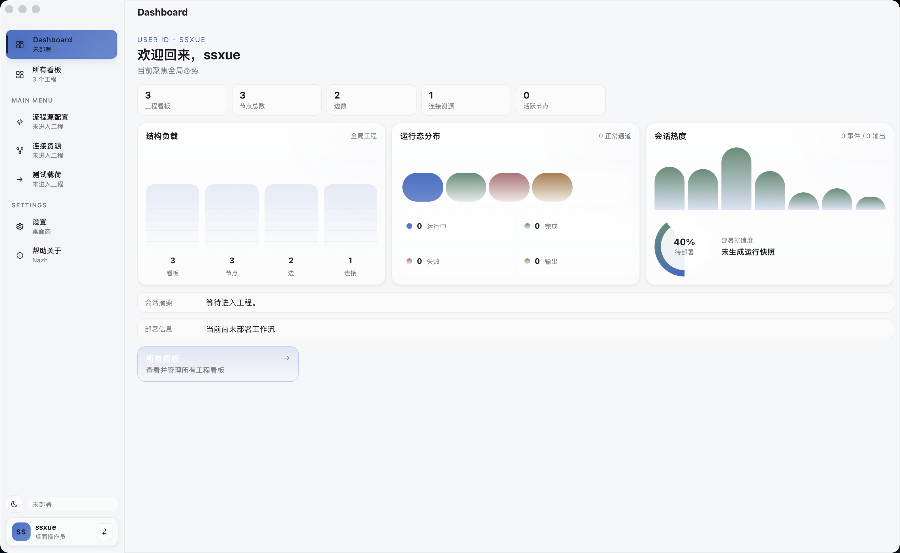
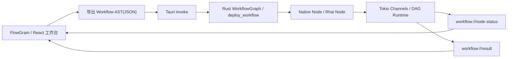

# Nazh

Nazh 是一个面向工业边缘场景的工作流编排原型，目标是把设备接入、数据转换、脚本逻辑和桌面化运维界面串成一套轻量但可靠的本地运行时。

当前仓库已经打通了 `Rust 引擎 + Tauri 桌面壳 + React/FlowGram 画布` 这一条主链路，适合继续往工业协议节点、运行观测和 AI 辅助编排方向迭代。

## 当前完成度

- 已完成 Rust 侧 `WorkflowContext`、线性 Pipeline、DAG 部署与事件流输出。
- 已完成 `Native Node` 与 `Rhai Node` 两类节点抽象，并支持脚本步数上限。
- 已完成 DAG 校验、节点超时保护、panic 隔离、失败不拖垮后续消息。
- 已完成连接资源池骨架，可注册、借出、释放并向节点注入连接上下文。
- 已完成 Tauri IPC：`deploy_workflow`、`dispatch_payload`、`list_connections`。
- 已完成 React + FlowGram 的桌面工作台，包括看板入口、画布编辑、连接资源、Payload 面板、运行观测与设置面板。
- 已补充基础自动化验证：`cargo test`、Web 构建、Tauri 桌面编译检查。

## 界面截图

开发态客户端主界面：



## 技术栈

- 引擎：Rust、Tokio、Serde、Rhai
- 桌面壳：Tauri v2
- 前端：React 18、TypeScript、Vite
- 画布编辑器：FlowGram.AI
- 前后端通信：Tauri `invoke` + `Window::emit`

## 核心架构



## 当前能力

### 1. 引擎能力

- 支持从 JSON 反序列化工作流图，并校验是否为无环 DAG。
- 支持按节点缓冲区大小创建 Tokio 通道，并将根节点作为工作流入口。
- 支持节点级 `timeout_ms`，超时会回传失败事件，不会直接拖死运行时。
- 支持 panic 捕获与错误事件输出，保证异常消息不会让整个 Pipeline 崩溃。
- 支持终端输出节点将结果写入 `result` 流，并向前端同步状态事件。

### 2. 节点模型

- `Native Node`：用于原生逻辑占位，目前支持消息注入、字段注入与连接上下文附着。
- `Rhai Node`：用于动态业务逻辑，支持脚本编译、执行和 JSON payload 读写。
- `ai_description` 字段已打通，方便后续接入自然语言生成脚本或节点建议。

### 3. 桌面工作台

- Dashboard：展示工程数量、节点/边统计、状态分布、热度与部署摘要。
- Boards：以工程看板形式进入工作区。
- Source：直接编辑工作流 AST 文本。
- Connections：维护连接定义并同步回 AST。
- Payload：发送测试载荷。
- Canvas：在 FlowGram 画布上查看与调整节点、连线和布局。
- Runtime Dock：展示部署快照、事件流、结果载荷与连接池预览。

## 项目结构

```text
.
├── src/                    # Rust 引擎核心
│   ├── context.rs          # WorkflowContext
│   ├── pipeline.rs         # 线性 Pipeline 与事件
│   ├── graph.rs            # DAG 解析、部署、运行事件
│   ├── nodes.rs            # Native / Rhai 节点
│   └── connection.rs       # 连接资源池骨架
├── src-tauri/              # Tauri 桌面壳与命令入口
├── web/                    # React + FlowGram 前端
├── tests/                  # Rust 集成测试
└── examples/               # 早期示例与参考材料
```

## 快速开始

### 环境要求

- Node.js 20 及以上
- npm
- Rust stable toolchain
- macOS 下建议先安装 Xcode Command Line Tools

### 1. 安装前端依赖

```bash
npm --prefix web install
```

### 2. 启动桌面开发版

```bash
cd src-tauri
../web/node_modules/.bin/tauri dev --no-watch
```

说明：Tauri 会自动拉起前端开发服务，正式交互路径以客户端窗口为主。

### 3. 运行测试与构建检查

```bash
cargo test
cargo check --manifest-path src-tauri/Cargo.toml
npm --prefix web run build
```

## 已验证状态

- `cargo test` 通过，包含 Pipeline 与 Workflow 端到端用例。
- `cargo check --manifest-path src-tauri/Cargo.toml` 通过。
- `npm --prefix web run build` 通过。
- Web 打包阶段存在大体积 chunk warning，当前不阻塞运行，但值得后续做分包优化。

## 关键命令与数据流

### Tauri Commands

- `deploy_workflow(ast: String)`：部署工作流图并注册事件/结果监听。
- `dispatch_payload(payload: Value)`：向当前工作流入口发送测试数据。
- `list_connections()`：读取运行时连接池快照。

### 前端示例数据

- `web/src/types.ts` 中内置 `SAMPLE_AST` 与 `SAMPLE_PAYLOAD`，可直接用于体验默认流程。

## 当前限制

- 连接资源池目前还是“工业连接骨架”，尚未真正对接 Modbus、MQTT、HTTP 等协议驱动。
- `Native Node` 目前更偏占位与数据注入，尚未扩展成完整工业节点库。
- Tauri 透明窗口在 macOS 下会提示未启用 `macos-private-api`，当前不影响开发，但会出现运行时 warning。
- Web 产物较大，后续需要结合 FlowGram/编辑器模块做拆包。

## 下一步建议

- 接入首批真实工业协议节点，例如 Modbus TCP、MQTT、HTTP Sink。
- 为运行观测增加更完整的 trace、日志与节点耗时统计。
- 把 `ai_description` 串到脚本生成链路，补全 AI Copilot 体验。
- 增加工作流保存、导入导出与项目级持久化。

## License

MIT
