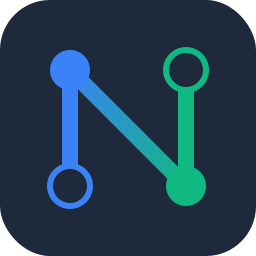
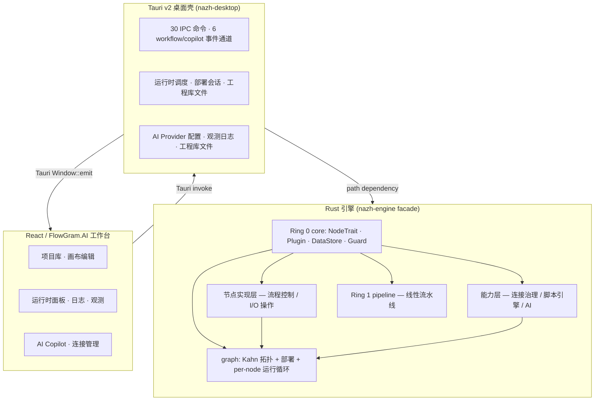

<p align="center">
  
</p>

<h1 align="center">Nazh</h1>

<p align="center">
  <code>AI原生工业边缘工作流编排引擎 —— 把设备数据流变成可执行的业务逻辑</code> · <code>Rust + Tauri + React</code>
</p>

## 项目定位

Nazh 面向**工业边缘侧的本地部署**场景：

- **零代码编排**：拖拽节点构建设备采集、协议转换、条件判断、通知告警的完整逻辑
- **边缘原生**：单机运行，断网可用，数据不出厂
- **协议全覆盖**：Modbus / MQTT / Serial / HTTP / SQLite 开箱即用
- **AI 增强**：自然语言生成规则逻辑，智能辅助异常检测

典型数据流：`设备传感器 → Nazh 工作流 → 业务动作（告警/存储/通知）`

## 核心场景

| 场景 | 痛点 | Nazh 方案 |
|------|------|----------|
| **设备预测性维护** | 传感器数据分散，告警规则难维护 | 拖拽式规则编排 + 多协议接入 + 异常自动路由 |
| **产线质量控制** | 质检数据与设备参数脱节 | 数据清洗 → 条件判断 → 自动停线/通知 |
| **能耗优化** | 电表/气表数据孤岛 | 定时采集 → 聚合计算 → 超阈值告警 |

---

## 👇 技术评估资料

以下内容为技术团队评估系统架构、扩展能力与集成方案所需。

## 工程架构

### Cargo Workspace（11 个 package）

Rust 引擎内核 + Tauri 桌面壳 + React/FlowGram.AI 可视化工作台。
分层设计保证内核零协议依赖，所有 I/O 能力通过插件扩展。

Ring 0/1 分层规则与设计哲学见 [`AGENTS.md`](./AGENTS.md) 与 [`docs/rfcs/0002-分层内核与插件架构.md`](./docs/rfcs/0002-分层内核与插件架构.md)。

### 三层架构



### 数据与控制分离

- **Payload（业务数据）** 走 `DataStore`（`ArenaDataStore` 内存默认实现），通过 `ContextRef`（~64 字节）在 MPSC 通道传递
- **Metadata（执行元数据：协议参数、连接信息、触发时刻）** 走 `ExecutionEvent::Completed` 事件通道，**不污染 payload**
- **Configuration（未来共享状态）** 将通过 `WorkflowVariables` 承载

## 内置节点

| 类别 | 节点 | 功能 |
|------|------|------|
| **触发器** | timer | 定时/周期触发 |
| | serialTrigger | 串口数据帧监听 |
| | mqttClient | MQTT 消息订阅 |
| **流程控制** | if / switch | 条件分支路由 |
| | tryCatch | 异常捕获处理 |
| | loop | 迭代循环 |
| | code | Rhai 脚本（支持自然语言生成） |
| **子图封装** | subgraphInput / subgraphOutput | 子图展开后的入口/出口桥接透传 |
| **纯计算** | c2f | 摄氏转华氏（Data 引脚 pull 语义） |
| | minutesSince | RFC3339 时间戳距今分钟数 |
| **I/O 操作** | modbusRead | Modbus TCP 寄存器读取 |
| | httpClient | HTTP 请求 / Webhook |
| | mqttClient | MQTT 消息发布 |
| | sqlWriter | SQLite 本地存储 |
| | barkPush | Bark iOS 推送 |
| | debugConsole | 调试输出 |

## AI 能力

- **自然语言生成规则**：描述业务需求 → 自动生成可执行逻辑
- **流式推理**：实时显示 AI 思考过程，透明可控
- **多模型支持**：OpenAI / DeepSeek / Moonshot 等兼容接口

## 连接治理

- **自动资源管理**：连接异常自动释放，节点崩溃不泄漏资源
- **故障熔断**：连续失败自动隔离，指数退避恢复
- **并发限流**：每连接可配置最大并发数
- **健康监控**：10 种状态自动诊断（就绪/忙/熔断/配置错误等）

## 运行时能力

- **多工作流并发**：同时运行多个独立工作流，事件带作用域隔离
- **背压与重试**：内置队列缓冲、失败重试、死信队列
- **可观测性**：JSONL 本地记录每节点执行状态，支持按时间/节点/trace 查询
- **重启恢复**：部署状态自动持久化，应用重启后自动恢复

## 快速开始

### 预编译包（推荐）

```bash
# macOS / Linux / Windows
curl -fsSL https://nazh.dev/install.sh | bash
nazh-desktop
```

### 源码编译

```bash
npm --prefix web install
cd src-tauri && ../web/node_modules/.bin/tauri dev
```

要求：Rust 1.94+、Node.js 20+

## 项目结构

```
crates/          # Rust 引擎库与 IPC bindings（9 crates）
src/             # DAG 编排与标准注册表
src-tauri/       # Tauri 桌面壳（workspace package）
web/             # React + FlowGram.AI 前端
tests/           # 集成测试
docs/            # 架构决策记录（ADR）与 RFC
```
