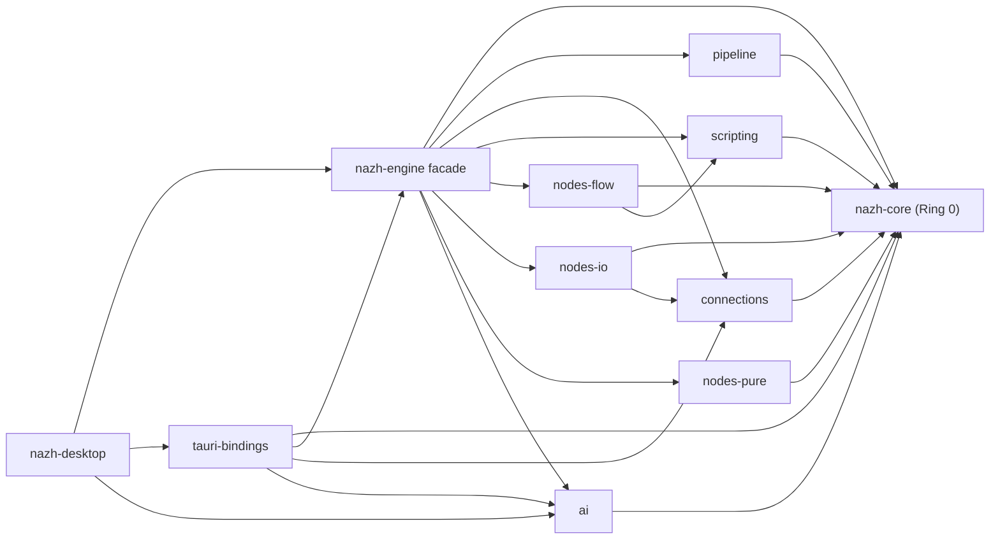

# 2026-04-29 Ring 1 横向耦合审计 findings

**范围**：`pipeline` / `connections` / `scripting` / `nodes-flow` / `nodes-io` / `nodes-pure` / `ai`，以及各 crate 的 `AGENTS.md` 与实际 `Cargo.toml` / `src/` 对照。

**结论**：真实依赖图没有 Ring 1 循环，也没有 `scripting` / `nodes-flow` 重新依赖 `ai` crate；ADR-0019 的依赖反转成立。主要问题是文档和 plan 仍按旧 crate 数量描述，部分 crate AGENTS 的模块树已经过期。

## 真实依赖图

取证命令：`cargo tree --workspace --edges normal --depth 1` 与各 crate `Cargo.toml`。

## ADR 宣称 vs 真实状态

| 项 | ADR / AGENTS 宣称 | 真实状态 | 结论 |
|----|-------------------|----------|------|
| Ring 0 不依赖工作区内其他 crate | `crates/core` 禁止任何工作区依赖 | `crates/core/Cargo.toml` 无工作区 crate 依赖 | 符合 |
| `scripting` 不依赖 `ai` crate | ADR-0019 后只看 Ring 0 `AiService` | `crates/scripting/Cargo.toml` 无 `ai`；代码用 `nazh_core::ai::AiService` | 符合 |
| `nodes-flow` 不依赖协议 / `ai` / `connections` | 通过 `scripting` + Ring 0 trait 注入 | `crates/nodes-flow/Cargo.toml` 只依赖 `nazh-core` / `scripting` / Rhai 等 | 符合 |
| `nodes-io` 是协议依赖收口点 | I/O 节点依赖 `connections` 和 optional protocol crates | `nodes-io` 依赖 `connections`，协议 crate 均 feature-gated | 符合 |
| Ring 1 crate 数量 | Phase B plan 写 “5 个 Ring 1 crate” | 当前实际至少 7 个：`pipeline`、`connections`、`scripting`、`nodes-flow`、`nodes-io`、`nodes-pure`、`ai` | 文档/plan 过期 |

## 主要 findings

| ID | 优先级 | 位置 | 发现 | 建议动作 |
|----|--------|------|------|----------|
| B2-R1-01 | P1 | `docs/plans/2026-04-28-architecture-review.md:62` | Phase B 仍写 “5 个 Ring 1 crate”，但 workspace 已有 `nodes-pure`，且 `pipeline` / `ai` 也是 Ring 1。按旧数字审计会漏项。 | 更新 plan / root AGENTS 的 crate 计数与 Ring 1 列表。 |
| B2-R1-02 | P1 | `AGENTS.md` Project Overview / workspace layout | root AGENTS 仍写 “9 crates”，Cargo workspace 当前 members 含 root、8 个 `crates/*`、`tauri-bindings`、`src-tauri`；布局段也漏 `nodes-pure`。 | Phase E 更新 root AGENTS 和 README crate 表。 |
| B2-R1-03 | P1 | `crates/connections/AGENTS.md:29` | `connections` AGENTS 的模块树列出 `guard.rs` / `health.rs` / `circuit_breaker.rs` / `pool.rs` / `metadata.rs`，但实际只有 `crates/connections/src/lib.rs`。 | 更新 crate AGENTS；若 Phase C 拆文件，再按真实拆分后的模块表写。 |
| B2-R1-04 | P1 | `crates/ai/AGENTS.md:25` | `ai` AGENTS 的模块树列出 `error.rs` / `service.rs`，但实际文件只有 `lib.rs` / `config.rs` / `client.rs` / `types.rs`。 | 更新 crate AGENTS，避免后续 agent 按不存在文件搜索。 |
| B2-R1-05 | P2 | `crates/scripting/src/lib.rs:322` | `ScriptNodeBase::new` 设置 `engine.set_max_operations(max_operations)`，但各节点 config 的 `max_operations` 没看到统一上限 / 下限规范；AGENTS 写“不允许取消”，接口层没有显式 clamp。 | 放入 Phase D 规范扫描或后续修复 PR：确认 Rhai `0` 语义并加部署期约束。 |
| B2-R1-06 | P2 | `crates/nodes-io/src/lib.rs:80` | `inherit_connection_id` 已集中处理多数协议节点；`serialTrigger` 走顶层 `def.connection_id()` 专用路径，是有意例外。 | 保留；在 `nodes-io/AGENTS.md` 明确 serialTrigger 例外，避免误改。 |
| B2-R1-07 | P2 | `crates/scripting/src/lib.rs:155` | `ScriptAiRuntime::complete` 每次 `ai_complete()` 都 spawn 线程并创建 current-thread Tokio runtime。耦合边界正确，但调用成本较高。 | 非 Phase B 修复项；若 AI 脚本高频调用，再评估注入 runtime handle 或 async bridge。 |

## 横向重复抽象检查

| 主题 | 检查结果 | 动作 |
|------|----------|------|
| `connections` vs 协议节点 `connection_id` | `nodes-io/src/lib.rs` 用 `inherit_connection_id` 统一顶层 fallback；协议节点通过 `SharedConnectionManager::acquire` 借连接。未发现重复 connection manager。 | 保留；补 serialTrigger 例外文档。 |
| `scripting` vs `nodes-flow` Rhai engine | `Engine::new` / `set_max_operations` 只在 `ScriptNodeBase::new` 出现；`nodes-flow` 节点组合 `ScriptNodeBase`。 | 符合。 |
| `ai` vs `scripting` 的 `ai_complete()` 注入点 | `scripting` 只依赖 Ring 0 `AiService`；`nodes-flow` 从 `RuntimeResources` 取 `Arc<dyn AiService>`；`ai` crate 是实现叶子。 | 符合 ADR-0019。 |
| pure-form 节点 | `nodes-pure` 是新增 Ring 1 子集，零协议依赖；但 root / facade 文档未同步完整。 | 文档修复。 |

## AGENTS.md 准确性摘要

| crate | 状态 | 发现 |
|-------|------|------|
| `crates/core` | 部分过期 | 模块树漏 `cache.rs`；Project Status 仍有 “NodeTrait::capabilities()” 首发描述，和当前设计冲突。 |
| `crates/connections` | 过期 | 模块树不匹配真实文件布局。 |
| `crates/scripting` | 基本准确 | ADR-0012 小节仍写 Phase 1，当前 root 已写 Phase 1+2；建议同步。 |
| `crates/nodes-flow` | 基本准确 | 依赖和节点表准确；ADR-0012 状态可更新到 Phase 1+2。 |
| `crates/nodes-io` | 基本准确 | 节点表和 feature 表准确；补 serialTrigger connection_id 例外即可。 |
| `crates/nodes-pure` | 准确 | 新 crate 文档简洁，需同步 root AGENTS / README。 |
| `crates/ai` | 部分过期 | 模块树列出不存在文件。 |
| `crates/pipeline` | 准确 | 未见明显漂移。 |
