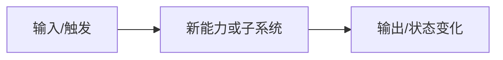

# {{功能名}} Design

**日期**：YYYY-MM-DD

## 背景

说明要解决的问题、已有约束、相关 ADR/RFC/Plan，以及当前代码中的事实依据。

## 目标

- 明确本设计要交付的行为或能力。
- 明确成功标准和非目标。

## 方案

描述组件边界、数据流、错误处理、兼容性和文档同步要求。

## 备选方案

| 方案 | 优点 | 缺点 | 结论 |
|------|------|------|------|
| A |  |  |  |
| B |  |  |  |
| C |  |  |  |

## 测试策略

- Rust：
- Frontend：
- E2E：
- 文档/生成物：

## 风险

- 风险：
- 缓解：
