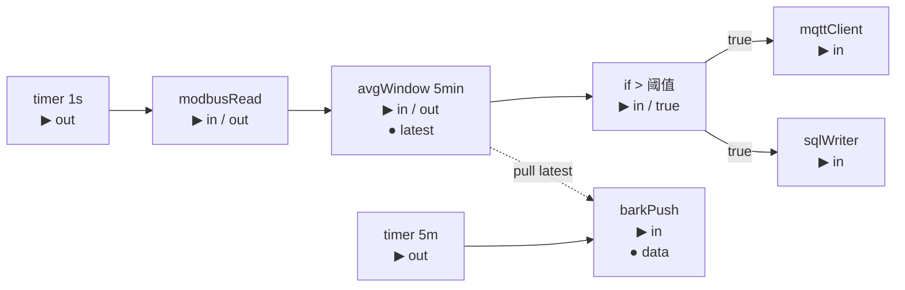
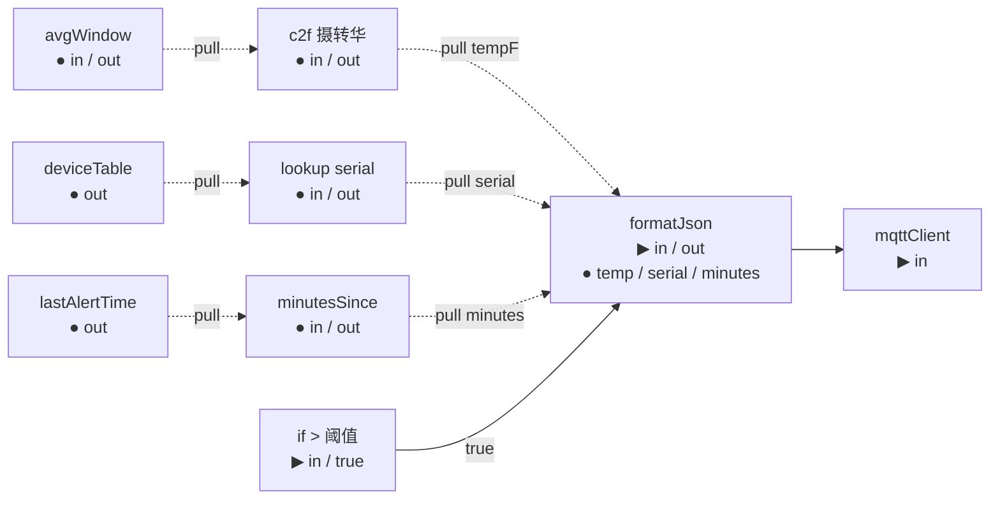
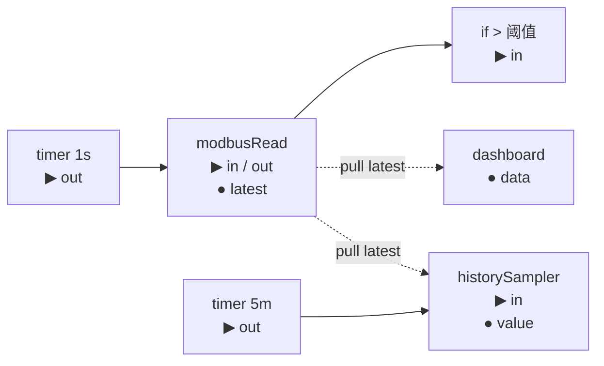

# ADR-0014 重构：引脚二分（Exec / Data）—— 设计文档

> **状态**：草稿（brainstorming 收敛后，待用户审）
> **日期**：2026-04-28
> **作者**：Niu Zhihong + Claude（brainstorming 协作）
> **关联**：
>
> - 取代 ADR-0014 原方案「边二分（EdgeKind）」——本设计若被接受，ADR-0014 将重写
> - 扩展 ADR-0010 Pin 系统（增加 `PinKind` 维度，与 `PinType` 正交）
> - 与 ADR-0011 `NodeCapabilities` 正交（引脚级语义 vs 节点级语义）
> - 为 ADR-0015「反应式数据引脚」铺垫（反应式作为 `PinKind::Reactive` 第三值，而非新增边类型）
> - 不与 ADR-0012「工作流变量」冲突（变量解决"具名跨工作流共享"，引脚二分解决"工作流内按需读最新值"）

---

## 〇、动机：为什么要做这件事（写给同事）

> 这一章浓缩"我们为什么要在这个时间点投入这件事"的论据。代码评审、月度同步、向上汇报都可以引用。技术细节看后续章节。

### TL;DR

> Nazh 现在的 DAG 是**单一 push 模型**——每条边都是"上游做完→主动捅下游"。这个模型在 IO 流水场景很自然，但已经在三类需求上**反复硌脚**：跨时钟读取、派生计算 fan-out、UE5 风格的组合表达式。
>
> 我们今天有两个选择：
>
> - **A. 不做**：每个场景各自用变量、用桥接节点、用复制粘贴绕行。画布越画越脏，下次想做 ADR-0013 子图、ADR-0015 反应式时**回头还要动这一刀**——那时影响面是今天的 3 倍。
> - **B. 现在做引脚二分**：14 类节点 0 改动、Phase 1 是骨架（业务无感）、Phase 2-5 渐进引入真实使用。一次性把"求值语义"摆到正确的层级，后续 ADR 直接受益。
>
> **本设计推荐 B**。下面是支撑论据。

### 一、当前痛点：3 个已经在产品里出现的丑

#### 痛点 1：跨时钟读取必须用变量绕行（画布污染）

> 1 秒主控环算滑动平均，5 分钟摘要环要"最新平均值"——同事在最近的工作流里反复遇到。

**当前唯一解法**：在主路径末端加 `setVariable("lastAvg")`，在第二条 timer 起点加 `getVariable("lastAvg")`。

```
[timer 1s]→[modbus]→[avg]→[if]→[mqtt]
                       ↓
                       [setVariable lastAvg]   ← 桥接节点，业务上无意义
[timer 5m]→[getVariable lastAvg]→[bark]        ← 桥接节点，业务上无意义
```

**代价**：
- 每条跨时钟链 +2 个"管线胶水"节点
- 变量名是字符串约定，没有类型校验直到运行时
- 用户读画布时业务流被基础设施噪声稀释

**引脚二分后**：直接从 `avg` 的 `●latest` Data 引脚拉一根虚线给 `bark`——0 桥接节点，结构所见即所得。

#### 痛点 2：派生计算 fan-out 重复算（性能浪费）

> Modbus 读一个寄存器值，要同时给：① 告警判断、② 仪表盘显示、③ 历史采样——三个不同节奏的消费者。

**当前情况**：`modbusRead` 只能 push 给所有下游。但下游节奏不同：
- dashboard 想 100ms 拉一次
- 历史采样想 5min 拉一次
- 告警想每次 trigger 都判断

只能：要么每个消费者各自接一条 timer 链 + Modbus（**重复 IO，5 倍设备压力**），要么硬塞一个"中转缓存"节点（**画布噪声**）。

**引脚二分后**：`modbusRead` 加一个 `●latest` Data 输出引脚，三个消费者按各自节奏拉同一份缓存——**Modbus 设备只读 1 次**。

> 工业现场对设备 IOPS 敏感（部分老 PLC 总线带宽 < 10 帧/秒）。这是**硬性能问题**，不是优雅性问题。

#### 痛点 3：UE5 风格的组合表达式无法干净表达

> 想给 MQTT 告警消息体加 3 个派生字段（华氏温度、距上次告警分钟数、设备序列号）——这些都是其他值的纯函数。

**当前**：要么把派生计算挂到主链上（`if → c2f → minutesSince → lookup → format → mqtt`），变成超长一条流水线；要么写到 `code` 节点里 Rhai 脚本（违反"画布表达即逻辑"的产品定位）。

**引脚二分后**：派生计算节点全是 Data 引脚（无 Exec），构成独立的"表达式树"，挂在 `format` 节点的 Data 输入上——**主控逻辑和派生数据视觉上完全分离**。

### 二、不做的代价：未来 3-4 个 ADR 都要回头动这一刀

引脚二分不是孤立的能力——它是后续多个 ADR 的**共同前置基础设施**。

| 后续 ADR | 为什么需要引脚二分 |
|---|---|
| **ADR-0013 子图与宏** | 子图边界引脚跨子图时，必须能表达"是 push 还是 pull"——否则子图组合不通 |
| **ADR-0015 反应式数据引脚** | 反应式 = Data 引脚 + 订阅语义。**没有 Data 引脚就没有反应式** |
| **Phase 6 EventBus + EdgeBackpressure** | "控制流压力"和"数据流压力"是两类背压策略——没有引脚二分只能粗粒度控制 |
| **AI 脚本生成深度集成** | AI 需要理解"哪些值是触发依赖、哪些值是数据依赖"——只有引脚二分能给精确语义 |

> **如果今天不做**：以上 4 个 ADR 全部要先把这一刀补上，**每次补都要碰 Runner 核心**。
>
> **如果今天做**：14 类节点 0 改动，Phase 1 是骨架（生产路径无感），Phase 2-5 各自独立交付。后续 ADR 直接复用。

### 三、价值产出（可量化）

| 维度 | 现在 | 引脚二分后 |
|---|---|---|
| 跨时钟工作流的桥接节点数 | 每条链 +2 个 setVar/getVar | 0 |
| Fan-out 场景的设备 IO 次数 | N（消费者数）× 触发频率 | 1 × 触发频率 |
| 派生表达式的画布表达 | 必须挂主链（线性串联） | 独立子树（视觉分离） |
| 后续 ADR 的实施成本 | 0013/0015/EventBus 各自重发明 | 直接消费 PinKind |
| 14 类现有节点的迁移成本 | — | **0 改动**（默认 Kind=Exec） |

### 四、同事最可能的反问

#### Q1：为什么不直接用 ADR-0012 工作流变量？变量也能跨时钟。

**A**：变量是**显式具名状态**，画布上要手动加 `setVariable / getVariable` 桥接节点；引脚二分让画布**直接表达数据依赖**，不需要桥接。

两者并不互斥——变量擅长"配置型参数热更新""跨工作流共享"；引脚二分擅长"工作流内的临时旁路"。这是两种不同的工具，不是替代关系。

#### Q2：ADR-0011 已经有 `PURE` capability 了，加 input-hash 缓存不就行了？

**A**：PURE 解决"同输入同输出的优化"，不解决"哪些值是被推、哪些值是被拉"的**语义表达**。PURE 节点仍然必须挂在主触发链上每次都被触发——它不能形成独立的表达式树。引脚二分和 PURE 是正交维度，两者都需要。

#### Q3：Runner 双路径会不会成为新的技术债？

**A**：双路径在工程上是**清晰可隔离的**：
- Exec 边走 MPSC 推送（现状）
- Data 边走 `ArcSwap<Option<CachedOutput>>` 写/读

两条路径之间没有共享可变状态，复杂度是离散的、可量化的。**不像状态机那种藕断丝连的债**。

#### Q4：用户能学会"两种引脚"吗？心智成本不是太高？

**A**：4 条规则一页能讲完：
1. 实心 ▶ = Exec（被推）
2. 空心 ● = Data（被拉）
3. 形状必须配对
4. 没有 Exec 引脚的节点 = 表达式

形状 + 颜色双重视觉差异（不是"两种边"那种微妙），UE5 Blueprint 已经验证 10+ 年。**99% 现有工作流不受影响**——复杂度只在用户主动选择 Data 引脚时才出现。

#### Q5：FlowGram.AI 支持吗？要不要换框架？

**A**：当前 FlowGram 已支持本设计需要的**全部扩展点**：自定义引脚渲染、`canAddLine` 连接校验钩子、SVG 线样式、节点头部模板。**不需要换框架**。

#### Q6：为什么不直接复用 UE5 Blueprint 工具？

**A**：UE5 Blueprint 是 UE 引擎内嵌实现（UObject 反射 + Slate 编辑器 + UE 字节码），**没有独立 SDK** 可以嵌入到 Tauri + React + Rust 栈。我们能做的是**借鉴它经过 10+ 年验证的视觉语言**（形状二分、颜色编码、Pure 节点头部色），在 FlowGram 上重新实现。

#### Q7：现在做是不是太早了？等更多需求出现再做不行吗？

**A**：恰恰相反——**现在是窗口期**：
- ADR-0010 Pin 系统已 Phase 1+2+3+4(部分)落地（前置条件齐备）
- ADR-0011 NodeCapabilities 已落地（正交维度的另一半已就位）
- 14 类节点已稳定（迁移面可控）
- 后续 ADR-0013/0015/EventBus 都依赖此能力（先做这个再做后续 = 后续直接受益）

**推迟做 = 后续每个 ADR 都要先补这一刀 + 碰核心 Runner**。

### 五、一句话总结

> **引脚二分不是"做不做的问题"——它是"今天浅做一刀，还是明天动到根的问题"**。
>
> 今天做：14 类节点 0 改动、骨架 Phase 1 业务无感、未来 4 个 ADR 直接受益。
> 推迟做：变量绕行越积越脏、设备 IO 重复浪费、4 个 ADR 反复补刀。

---

## 一、为什么重写 ADR-0014？

### ADR-0014 原方案的问题

ADR-0014 选择"边二分（`EdgeKind::Exec` / `EdgeKind::Data`）"作为求值语义的载体。这个选择有三个本质性问题：

1. **同引脚出来的多条线行为不一致**：用户从节点同一引脚拖出两条线，一条选 Exec、一条选 Data，行为完全不同——这是 UE5 Blueprint 没有的范式，用户没有现成直觉，调试困难。
2. **与 ADR-0010/0011 心智模型脱节**：ADR-0010 已经把"语义层"放在引脚上（PinType=数据形状），ADR-0014 又新开一层"边语义"——引擎里同时有"引脚级类型"和"边级语义"两套机制，**正确的演进是扩展引脚维度，不是新开边维度**。
3. **不符合 UE5 已被验证的范式**：UE5 Blueprint 表面看像"两种边"（白色 exec / 蓝色 data），实际上**蓝色不是边的属性，是引脚的属性**。边的颜色由两端引脚派生。

### 引脚二分的核心主张

> **求值语义（push 还是 pull）是引脚的属性，不是边的属性**。
> **边的语义由两端引脚自动派生**。

新增枚举 `PinKind`，作为 ADR-0010 `PinDefinition` 上与 `PinType` 正交的第二维。

```
PinDefinition
├── PinType（数据形状）—— 已有，ADR-0010
├── PinKind（求值语义）—— 新增，本设计
└── PinDirection、required、label、id、description ……
```

---

## 二、Nazh 当前 vs UE5 Blueprint

### 模型对比

| 维度 | Nazh 当前 | UE5 Blueprint |
|---|---|---|
| 节点本质 | 工业协议适配器 + 流程节点（14 类） | UFunction / UEvent 包装（任意游戏逻辑） |
| 引脚维度 | 单维：`PinType`（Bool/Int/.../Json/Custom） | 二维：Exec(white) + 数据类型（按颜色编码） |
| 边语义 | 全 push（Tokio MPSC 推） | Exec=push、Data=pull |
| 触发器 | `TRIGGER` capability 节点（timer/serial/MQTT-sub） | Event 节点（BeginPlay / Tick / Custom Event） |
| 纯节点 | `PURE` capability，但仍走 push 链 | 无 Exec 引脚 = 不参与触发链，按需求值 |
| 部署/编译 | Tokio 异步 + 拓扑（Kahn）校验 | C++ 翻译 → UE 字节码 |
| 资源管理 | RAII `ConnectionGuard` + `LifecycleGuard` | UObject GC |
| 跨进程 | Tauri IPC（必须） | 引擎内嵌（不跨进程） |
| AI 集成 | `AiService` trait 一等公民（ADR-0019） | 无 |
| 长期运行 | 24/7 工业现场 | 游戏会话生命周期 |
| 错误处理 | `Result<T, EngineError>` + DLQ + 事件流 | 异常 + 有限 Try-Catch 节点 |
| 调试可观测 | trace_id + ExecutionEvent + 元数据通道 | UE Debugger（仅编辑器内） |

### 可借鉴的部分

✓ **二维引脚模型**：Exec/Data 分离 + 数据类型独立编码——这是核心
✓ **Pure 节点形态**：无 Exec 引脚 = 表达式节点（绿色头部）
✓ **类型颜色编码**：经验证的颜色集（Bool 红 / Int 青 / Float 绿 / String 粉 / Object 蓝）
✓ **形状二分**：Exec 三角、Data 圆——视觉差异显著、易区分
✓ **连线规则**：形状必须配对（实心连实心、空心连空心）

### 不可复用的部分

✗ **UE5 Blueprint 引擎本身**——`UEdGraph` / `UK2Node` 是 UObject，深度依赖 UE 反射系统
✗ **UE5 字节码编译/运行时**——Nazh 是 Tokio 异步流水线，模型差异不可桥接
✗ **UE5 节点库**——都是游戏 API，与工业领域无关
✗ **UE5 Slate 编辑器**——与 UE 工具链耦合，无独立 SDK
✗ **不存在"独立的 Blueprint SDK"** 能嵌入 Tauri + React

---

## 三、开源方案与复用策略

### 已用：FlowGram.AI

Nazh 当前画布栈基于 `@flowgram.ai/*`（字节开源 v0.4.19），已支持本设计需要的全部扩展点：

| FlowGram 能力 | 用于本设计 |
|---|---|
| 自定义节点渲染 | 已用 |
| 自定义引脚 / 端口 | 引脚形状、颜色 |
| `canAddLine` 连接校验钩子 | ADR-0010 Phase 2 已接入；本设计扩展为同时校验 PinType + PinKind |
| 自定义线条样式（CSS + SVG） | Exec 实线、Data 虚线 |
| 节点头部模板 | Pure 节点绿头、Trigger 红头等 |

**结论**：不换框架。在 FlowGram 之上扩展引脚视觉与 PinKind 校验。

### 同类参考（仅借鉴，不替换）

| 项目 | 借鉴点 | 不替换 FlowGram 的原因 |
|---|---|---|
| Litegraph.js | 类型颜色 + 形状二分（Comfy UI 已验证） | 替换成本 > 收益；无 React 集成 |
| Rete.js v2 | Socket 类型校验 + connection validator API | 同上 |
| Node-RED | 流程编排心智 | 推模型，无引脚二分概念 |
| n8n | 工作流自动化 UI | 同 Node-RED |
| Apache NiFi | 背压/流量管理 | 视觉范式偏简单，与本设计无关 |
| Blueprintue | UE5 Blueprint 视觉 Web 模拟 | 仅参考视觉语言 / 配色 |
| Blockly | 积木编程 | 范式不同 |

### 为什么不能"直接复用 UE5"

UE5 Blueprint 的实现栈（C++ 引擎 + UObject 反射 + 字节码 + Slate 编辑器）**深度耦合在 UE 引擎里**：

- 编辑器（蓝图图形）依赖 UE5 编辑器框架，无 standalone 版本
- 节点编译产物是 UE 字节码，由 UE 虚拟机解释——无 portable runtime
- 没有"独立 Blueprint SDK"可以嵌入到 Tauri + React + Rust 栈

我们能做的：**借鉴它经过 10+ 年游戏行业验证的视觉语言与心智模型，在 FlowGram 上重新实现**。

---

## 四、四个核心用例

> **视觉记号约定（mermaid 限制 → 真实 UI 用 SVG 渲染）**：
> - mermaid 图：`-->` 表示 Exec 边（实线箭头）、`-.->` 表示 Data 边（虚线箭头）
> - 真实 UI：Exec=粗实线（白）、Data=细虚线（按数据类型着色）
> - 节点框内 `▶` = Exec 引脚（push）、`●` = Data 引脚（pull）

### 用例 1：朴素 IO 链——全 Exec（行为不变）

> **业务**：每秒读 PLC 温度，超 80°C 直接发 MQTT 告警。


**引脚声明**：所有引脚均为 Exec（节点声明 PinKind 时不写，走默认 Exec）。

**用户体验**：**与现状 100% 一致**。引入 PinKind 不让简单工作流变复杂。

**关键产品保证**：
> 复杂度只在用户**主动选择 Data 引脚**时才出现。
> 99% 的现有工作流不需要改一行。

---

### 用例 2：跨时钟读取——Exec + Data 混合

> **业务**：1 秒主控环计算 5 分钟滑动平均；另一个 5 分钟 timer 把"最新平均值"推送到 Bark。



**关键：`avgWindow` 节点声明 2 个输出引脚**：
- `▶out`（Exec）—— 每次被 timer 1s 触发后推给下游 if
- `●latest`（Data）—— 每次 transform 完成后写入缓存槽，不主动推

**`barkPush` 输入引脚也是 `●data`**——它声明"我需要一份最新平均，你别推给我，我被自己的 timer 触发时去拉"。

**用户操作**：
1. 拖 `avgWindow` 节点。属性面板看到它声明 2 个输出引脚（不同形状）
2. 主路径从 `▶out` 拖实线到 if
3. 第二条 timer 从 barkPush 的 `●` 输入拖虚线到 avgWindow 的 `●latest`
4. **画完了**——没有 `setVariable / getVariable` 桥接节点

**系统行为**：
- timer 1s 每 tick → modbus → avgWindow 计算 → 写入 `latest` 缓存槽 + 推给 if
- timer 5m 每 tick → barkPush 被触发 → transform 前先去 avgWindow 的 `latest` 缓存槽拉一份 → 拼装 payload → push 到 Bark

**对比 ADR-0014 边二分版本**：
- 边二分：用户右键边改 `EdgeKind`——同一个 ▶ 出来两种行为，调试困惑
- 引脚二分：用户**从不同形状的引脚拖出**——视觉上引脚就告诉你它的语义，**连线规则是引脚类型派生的**

---

### 用例 3：UE5 表达式树——多层 pure 节点全 Data 引脚

> **业务**：MQTT 告警消息体要包含"温度（华氏度）/ 上次告警距今分钟数 / 设备序列号"。这三个东西都是从其他数据**派生**出来的，不需要主动触发。



**节点定义**：
- `c2f` / `lookup` / `minutesSince`—— 纯函数，**全是 Data 引脚（无 Exec）**——它们就不参与触发链
- `formatJson`—— 4 个输入（1 个 Exec、3 个 Data），1 个 Exec 输出——它**等被 if 触发后**，去拉 3 个 Data 输入的最新值，组装 JSON 后推下游

**用户操作**：
1. 拖 `c2f / lookup / minutesSince` 这些纯节点——它们的引脚**全是空心圆**（节点头部绿色，提示是 Pure 节点）
2. 拖虚线连接它们——表达式树
3. 在 `formatJson` 上，**实心引脚连主触发链**（被 if 推）、**空心引脚连派生数据**
4. 主控逻辑（哪个 trigger 触发它）和派生数据（这些值从哪来）**视觉上完全分离**

**为什么这是 UE5 精髓**：
> UE5 蓝图里这些"派生计算"叫 **pure node**——你不用关心它们什么时候算，它们在被需要时即时算。Nazh 这里映射到引脚级：**没有 Exec 引脚的节点 = pure 节点**。

---

### 用例 4：旁路 fan-out——同节点同时供推与拉

> **业务**：modbusRead 一次读取后：① 主路径告警判断、② 仪表盘组件实时显示、③ 历史曲线节点按需采样。



**关键观察**：modbusRead 的 `●latest` Data 输出引脚被**两个下游同时拉**，它们各有各的触发节奏：
- `dashboard`：前端 polling 100ms 拉一次
- `historySampler`：每 5min 被 timer 触发时拉一次

**modbusRead 节点的双输出引脚**：
- `▶out`（Exec）—— 每次 1s 触发后推给 if 判断（push 链）
- `●latest`（Data）—— 每次 transform 完成后顺手写一份到缓存槽（pull 旁路）

**对比方案 B（节点二分）**：节点二分必须把 modbusRead 整体声明为"数据源"或"执行"二选一——如果声明数据源就没法直接推 if，要么加桥接节点要么把 if 改成"自己拉"，结构更乱。

**这个用例展示引脚二分比节点二分多出来的表达力**：
> **同一节点同时承担"主路径推"和"旁路拉"**，是工业现场最常见的 fan-out 模式（一次采集多个消费者）。

---

## 五、视觉规范（UE5 风格，FlowGram 上实现）

### 引脚形状（语义维度）

| 形状 | Unicode | 语义 | UE5 对应 | 用法 |
|---|---|---|---|---|
| 实心三角 | ▶ U+25B6 | Exec（push） | UE5 white exec arrow | 被推、要推 |
| 实心圆 | ● U+25CF | Data 标量（pull） | UE5 colored circle | 被拉、能给拉 |
| 网格方点 | ▦ U+25A6 | Data 数组（`PinType::Array`） | UE5 array pin | 容器型 |
| 菱形 | ◇ U+25C7 | Data Custom（命名协议类型） | UE5 struct pin | 协议特化 |
| 空心圆 | ◯ U+25EF | Wildcard / `Any` | UE5 wildcard | 类型未特化 |

**形状由 PinType 与 PinKind 联合决定**：
- `PinKind::Exec` → 永远三角 ▶
- `PinKind::Data` + `PinType::Array` → 网格方点 ▦
- `PinKind::Data` + `PinType::Custom` → 菱形 ◇
- `PinKind::Data` + `PinType::Any` → 空心圆 ◯
- `PinKind::Data` + 其他标量类型 → 实心圆 ●

### 颜色映射（数据维度，与 PinKind 正交）

参考 UE5 标准配色，CSS 变量化以适配明暗主题：

| PinType | UE5 颜色（参考） | Nazh CSS 变量建议 |
|---|---|---|
| Bool | 红 `#B00000` | `--pin-bool` |
| Integer | 青 `#1FB7FF` | `--pin-int` |
| Float | 绿 `#2FB75F` | `--pin-float` |
| String | 粉 `#E91E63` | `--pin-string` |
| Json | 黄 `#DAA520` | `--pin-json` |
| Binary | 紫 `#6A0DAD` | `--pin-binary` |
| Array | 内层颜色 + 网格形 | 派生 |
| Custom | 灰 + 名称 hash 着色 | `--pin-custom-*` |
| Any | 白 / 灰边 | `--pin-any` |
| Exec（无数据类型） | 白色 | `--pin-exec` |

### 连线样式

| 边 | 线型 | 箭头 | 颜色 |
|---|---|---|---|
| Exec 边 | 粗实线（2.5px） | 三角箭头 | 白 / `--pin-exec` |
| Data 边 | 中等粗细 + 虚线段（1.5px, 4-2 dash） | 圆点 | 与上游 Data 引脚色一致 |

### 节点头部色（参考 UE5）

| 节点种类 | 头部色 | 标记 | 判断规则 |
|---|---|---|---|
| **Pure 节点** | 绿 `#2FB75F` | 上下半圆形头 | input/output 全无 Exec 引脚 |
| **Trigger 节点** | 红 `#B00000` | 雷标 | 有 `NodeCapabilities::TRIGGER` |
| **Branching 节点** | 蓝 `#1FB7FF` | 菱形装饰 | 有 `NodeCapabilities::BRANCHING` |
| **普通转换** | 灰蓝 `#3A4F66` | 默认 | 其他 |

> **Pure 节点视觉特化**：UE5 Blueprint 里 pure 节点是**圆角胶囊形+绿色头部**，不像普通节点的方框。本规范沿用——FlowGram 自定义节点 React 组件足以实现。

---

## 六、模型扩展（Rust 类型）

### 新增 `PinKind` 枚举

```rust
// crates/core/src/pin.rs

/// 引脚的求值语义。与 [`PinType`]（数据形状）正交。
///
/// 这是 ADR-0014 重构（引脚二分）引入的维度。决定了**通过这个引脚连入/连出的边**
/// 在 Runner 中的行为路径：
///
/// - [`Exec`](Self::Exec)：上游完成 transform → MPSC push → 下游 transform。
///   这是 Nazh 1.0 的默认语义，所有现有节点不显式声明时走这条路径。
/// - [`Data`](Self::Data)：上游完成 transform → 写入输出缓存槽（不 push）；
///   下游被自己的 Exec 边触发后，在 transform 前从缓存槽拉取。
///
/// **设计前提**：引脚对引脚必须 PinKind 一致——Exec 只能连 Exec、Data 只能连 Data。
/// 部署期校验拒绝跨 Kind 连接。
#[derive(Debug, Clone, Copy, PartialEq, Eq, Hash, Default)]
#[derive(Serialize, Deserialize)]
#[cfg_attr(feature = "ts-export", derive(TS), ts(export))]
#[serde(rename_all = "lowercase")]
pub enum PinKind {
    /// 推语义。**默认值**——所有现有引脚不声明时为 Exec，向后兼容 14 类节点。
    #[default]
    Exec,
    /// 拉语义。上游写缓存、下游被自己的 Exec 边触发时读缓存。
    Data,
}
```

### 扩展 `PinDefinition`

```rust
pub struct PinDefinition {
    pub id: String,
    pub label: String,
    pub pin_type: PinType,
    pub direction: PinDirection,
    pub required: bool,
    /// 求值语义。未声明默认 [`PinKind::Exec`]，向后兼容现有 14 类节点。
    #[serde(default)]
    pub kind: PinKind,
    pub description: Option<String>,
}
```

### 边校验规则升级

部署期校验在 PinType 兼容性之外，新增：

```rust
// crates/core/src/pin.rs

impl PinKind {
    /// 上游引脚 PinKind → 下游引脚 PinKind 是否兼容。
    /// 规则：必须严格相等。Exec ↔ Exec、Data ↔ Data。
    pub fn is_compatible_with(&self, other: &Self) -> bool {
        self == other
    }
}
```

跨 Kind 连接 → 部署拒绝，错误消息提示"引脚形状不匹配（上游 Exec ▶，下游 Data ●）"。

### Pure 节点识别（自动派生，无需新 capability）

> **节点是 Pure 节点形态 ⟺ 它的 input_pins 与 output_pins 都不含 Exec 引脚**。

这与 ADR-0011 的 `PURE` capability **正交**：

| 维度 | ADR-0011 PURE capability | Pure 节点形态（本设计） |
|---|---|---|
| 含义 | 同输入同输出 + 无副作用 | 不参与触发链（无 Exec 引脚） |
| 判断方式 | 节点作者显式声明 | 由 `input_pins/output_pins` 自动推导 |
| 用途 | 启用 input-hash 缓存（Runner 第三阶段） | 不在 Tokio 任务列表中 spawn，被下游 transform 时即时求值 |

一个节点可能：
- ✅ ADR-0011 PURE + 有 Exec 引脚（如 `if`、`switch`）→ 参与触发链的纯函数
- ✅ Pure 节点形态 + 不打 ADR-0011 PURE → 不参与触发链但可能有副作用（少见，谨慎使用）
- 🌟 **两者都满足**（理想 pure 计算节点 `c2f`、`lookup`）→ 可激进缓存且不占触发链

### Runner 双路径

```text
// 部署期（拓扑排序、任务 spawn）：
1. 拓扑排序仅考虑 Exec 边（Data 边不参与）
2. Pure 节点形态（无 Exec 引脚）的节点不进 Tokio task spawn 列表
3. Data 边参与独立的"求值依赖图"环检测——若有环，部署期拒绝

// Runtime（运行时）：
当上游节点 transform 完成后：
    for each output_pin:
        match output_pin.kind:
            Exec → 通过 MPSC 推送 ContextRef 给所有 Exec 边下游（现状）
            Data → 写入该节点 OutputCache 中对应槽位（CachedOutput）
                  （不 push 任何东西）

当节点被 Exec 边触发、即将执行 transform 时：
    pre-transform: collect_data_inputs():
        for each Data input pin of this node:
            找到上游节点 + 上游对应 Data 输出引脚
            从上游 OutputCache 槽位读取 CachedOutput
            (若槽位空：按下游 PinDefinition 配置兜底——Phase 4 决策)
        compose payload from { exec_payload, data_inputs }
    call transform(composed_payload)
```

### `OutputCache` 结构

```rust
// crates/core/src/cache.rs（新文件）

pub struct OutputCache {
    /// 每个 Data 输出引脚一个槽，用 ArcSwap 做无锁更新。
    /// key 是 PinDefinition.id。
    slots: HashMap<String, Arc<ArcSwap<Option<CachedOutput>>>>,
}

pub struct CachedOutput {
    pub value: Value,
    pub produced_at: DateTime<Utc>,
    /// 上游产生此值时的 trace_id。下游拉取时记录到自己的事件中——
    /// 一次 transform 可能关联多个 trace（Exec 触发 trace + 多个 Data 拉取 trace）。
    /// 观测层接受此事实。
    pub trace_id: Uuid,
}
```

---

## 七、与其他 ADR 的关系

### 与 ADR-0010 Pin 系统：扩展

PinKind 是 PinDefinition 上的新维度，与 PinType（数据形状）正交。Phase 1+2+3+4(部分) 已落地的能力不变，本设计在 PinDefinition 上加一字段。

### 与 ADR-0011 NodeCapabilities：正交

PinKind 是引脚级，capabilities 是节点级。两者都保留，互不替代。详见上文「Pure 节点识别」。

### 与 ADR-0012 工作流变量：互补

| | 工作流变量（ADR-0012） | 引脚二分（本设计） |
|---|---|---|
| 解决 | 具名跨工作流共享状态 | 工作流内按需读最新值 |
| 性质 | 显式状态机（变量名锚点） | 隐式表达式（图结构锚点） |
| 用例 | 配置阈值、跨工作流通信、运行时改参数 | UE5 风格 pure 计算、跨时钟旁路 |

两者**目标不同、可共存**——用例 2（跨时钟读取）原本必须用变量绕行，引脚二分让画布更干净；但变量在"配置型参数热更新"场景仍不可替代。

### 与 ADR-0013 子图与宏：穿透

子图边界上的引脚必须保留 PinKind——子图入口若是 Data 引脚，子图内对应入口节点也应该是 Data。这不增加复杂度，是引脚二分自然的结果。ADR-0013 在自己的 plan 里处理。

### 与 ADR-0015 反应式数据引脚：演进路径

ADR-0015 提议在 Data 引脚基础上加"订阅"语义——上游变化自动通知下游。本设计为它准备了正确的层级：

> **反应式 = `PinKind::Reactive` 第三种值**，而非新增"边类型"。

```rust
pub enum PinKind {
    Exec,        // 当前
    Data,        // 当前
    Reactive,    // 未来 ADR-0015
}
```

这意味着 ADR-0015 不需要新概念，只需在现有维度上加一个值——这是**正交设计的红利**。

---

## 八、向后兼容

- 所有现有 14 类节点的 `input_pins` / `output_pins` 不写 `kind` 字段，编译期默认 `PinKind::Exec`
- 所有现有工作流 JSON AST 不变——边没有新字段，引脚 kind 通过节点声明自动推导
- 部署期校验对存量工作流 100% 通过
- IPC 类型 `PinDefinition` 增加 `kind` 字段（ts-rs 重新导出），但前端反序列化时未声明等价于 `Exec`

---

## 九、Phase 划分（实施路线图）

### Phase 1：基础设施（骨架，最小可用）

- Ring 0 添加 `PinKind` 枚举与 `PinDefinition.kind` 字段
- 部署期校验：跨 Kind 连接拒绝
- Runner 双路径**骨架**：Exec 边 push（现状）+ Data 边写缓存槽
- `OutputCache` 数据结构（`ArcSwap<Option<CachedOutput>>`）
- 拓扑排序仅考虑 Exec 边；Data 边独立环检测
- 14 类节点全部走 Kind=Exec 默认值，**编译期不需改一行节点代码**
- ts-rs 导出 `PinKind` 到前端
- **测试**：`#[cfg(test)]` 模块内引入 stub 节点（如 `_test_pure_compute`）验证双路径——业务节点集成在 Phase 2，Phase 1 只确保骨架正确

**验证**：所有现有工作流测试不变；stub 节点测试覆盖双路径关键路径（缓存写、跨 Kind 拒绝、Data 边环检测）。

### Phase 2：第一个真实 Data 用例（用例 2）

- 选 1-2 个**现有节点**扩展 Data 引脚作为首个真实用例。候选方向（具体在 Phase 2 plan 决策）：
  - **方向 A**：给 `modbusRead` 加 `●latest` 输出引脚——把"最近一次读数"暴露为可拉缓存。改动最小，复用现有节点
  - **方向 B**：同时引入新节点 `slidingAverage`（PURE + 双输出 Exec/Data）演示 ADR-0011 PURE 与本设计的协同
- IPC `describe_node_pins` 返回包含 `kind`
- 前端 ts-rs 类型同步 + `pin-compat.ts` 升级（PinKind 校验）
- 前端 FlowGram 引脚渲染：Exec=三角、Data=圆 + 颜色编码
- FlowGram `canAddLine` 钩子接入 PinKind 校验
- 用例 2（跨时钟读取）真实可运行
- E2E 测试

### Phase 3：UE5 风格 Pure 节点（用例 3）

- 引入第一批纯计算节点（`c2f`、`minutesSince`、`lookup`）—— 只声明 Data 引脚
- 部署期识别"无 Exec 引脚节点" = pure 节点形态
- Runner 路径：pure 节点不在 Tokio task spawn 列表，由其下游 transform 时点拉求值
- 前端节点头部色：pure 节点绿色头 + 圆角形（CSS）
- 用例 3（表达式树）真实可运行

### Phase 4：缓存生命周期与策略

- 空槽兜底（`default_value` / `block_until_ready` / `skip` 三选一，引脚级声明）
- TTL 策略（如有需要，按需引入）
- ADR-0011 PURE 缓存与引脚二分协同：PURE 节点 + Data 输出 = 输入 hash 缓存可跨 trace 命中
- 用例 4（旁路 fan-out）真实可运行

### Phase 5：视觉打磨

- 节点头部色按 capability 自动着色（Pure / Trigger / Branching / 普通）
- 颜色映射 CSS 变量化（明暗主题适配）
- minimap / 调试视图同步
- 引脚 tooltip 显示 PinKind + PinType（沿用 ADR-0010 Phase 4 已建框架）
- AI 脚本生成 prompt 携带 PinKind 信息

### 不在本设计内的事项

- 反应式（订阅）—— ADR-0015 单独追踪
- 子图穿透 —— ADR-0013 单独 plan 处理
- AI 脚本生成对 PinKind 的深度理解 —— ADR-0010 Phase 4 同步推进

---

## 十、风险与缓解

### 风险 1：Phase 1 实施引入 Runner 复杂度

**缓解**：Phase 1 只引入"双路径分支骨架 + 缓存槽写入"，业务节点 Phase 1 全部保持 Kind=Exec 默认值——Data 引脚仅在 `#[cfg(test)]` 模块的 stub 节点上声明，不影响生产路径。Phase 2 才把第一个真实业务节点接入 Data 引脚。Runner 改造范围被严格限定在 Phase 1。

### 风险 2：缓存空槽（下游被触发时上游还没执行过）

**缓解**：
- 引脚级声明 `default_value` 或 `block_until_ready` 策略
- 部署期校验至少一种兜底策略
- 此问题**Phase 4 才需要决策**——Phase 1-2 仅 panic 或返回 None，限定在测试覆盖

### 风险 3：trace_id 不一致（下游一次 transform 关联多个 trace）

**缓解**：
- `CachedOutput` 携带原始 `trace_id`
- 下游 ExecutionEvent 同时记录多个来源 trace（**一个 transform 可能关联多个 trace_id**——观测层接受）
- 前端事件视图升级为"主 trace + 拉取 trace 列表"

### 风险 4：循环依赖（Data 边制造"A 依赖 B 缓存、B 依赖 A 缓存"）

**缓解**：
- 部署期拓扑排序仅考虑 Exec 边
- Data 边参与独立的"求值依赖图"环检测——若有环，部署期拒绝并报错
- 这一规则在 Phase 1 就实现，作为第一道防线

### 风险 5：用户首次接触"两种引脚"心智成本

**缓解**：
- 引脚教程一页能讲完（4 条规则）
- 形状差异显著（▶ vs ●），不同于"两种边"的微妙
- Pure 节点头部色差异化进一步降低视觉混淆
- 99% 现有工作流不受影响——这是最重要的认知保护

### 风险 6：FlowGram 引脚渲染性能（每个引脚 SVG 元素）

**缓解**：
- 单工作流引脚总数典型在 50-200 量级，浏览器可接受
- 形状用 SVG 静态 path，颜色用 CSS 变量
- 实测后再考虑虚拟化

---

## 十一、待审定问题（不阻塞 spec 审）

以下问题可在对应 Phase 的 plan 文档里展开决策，不在本设计文档内拍板：

- **Phase 4 决策**：缓存空槽兜底策略的默认行为（block / skip / default_value）
- **Phase 4 决策**：是否引入 TTL（"超过 N 秒未更新视为过期"）
- **Phase 5 决策**：颜色集是否需要色盲友好替代（红绿色弱）
- **Phase 5 决策**：节点头部形状（圆角胶囊 vs 圆角矩形）的具体 CSS
- **跨 Phase**：AI 脚本生成器如何在 prompt 里描述 PinKind（Phase 2/5 同步推进）

---

## 十二、产出物清单

本设计文档（spec）通过 user review 后，将产出：

- 重写后的 `docs/adr/0014-执行边与数据边分离.md`（标题改为"引脚求值语义二分"，方案 C 由"边二分"改为"引脚二分"，引用本 spec）
- `docs/superpowers/plans/2026-04-28-adr-0014-phase-1-pin-kind-基础.md`（Phase 1 实施计划）
- 后续每 Phase 一份 plan（Phase 2-5 各自独立）

`AGENTS.md` 的 ADR 执行顺序 + 进度状态在每 Phase 落地后同步更新。
