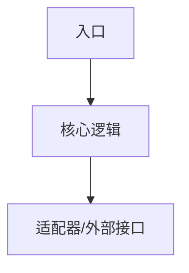

# {{路径或模块名}} AGENTS.md

> 使用说明：复制到模块、crate、服务或重要目录根部并改名为 `AGENTS.md`。局部 `AGENTS.md` 只记录该目录的局部规则；跨项目通用规则仍由根目录 `AGENTS.md` 负责。

## 模块概览

- **路径**：`{{path}}`
- **职责**：{{responsibility}}
- **不负责**：{{non_goals}}
- **所属层次/边界**：{{layer_or_boundary}}

## 对外暴露

| 类型 | 名称/路径 | 稳定性 | 说明 |
|------|-----------|--------|------|
| API / trait / schema / command / event | {{name}} | {{stable_or_internal}} | {{description}} |

## 内部结构

## 依赖约束

允许依赖：

- {{allowed_dependency}}

禁止依赖：

- {{forbidden_dependency}}

新增依赖前必须检查：

- [ ] 是否跨越根目录 `AGENTS.md` 声明的架构边界。
- [ ] 是否能通过 trait、配置或适配器降低耦合。
- [ ] 是否需要 ADR/RFC 记录。

## 修改规则

| 改动 | 必须同步更新 |
|------|--------------|
| 公开 API 或数据结构变化 | 调用方、测试、文档、生成物 |
| 配置或环境变量变化 | README、示例配置、部署文档 |
| 节点能力、pin 或 IPC 变化 | crate `AGENTS.md`、合约测试、前端类型 |

## 验证

| 命令/步骤 | 运行位置 | 说明 |
|-----------|----------|------|
| `{{command}}` | `{{location}}` | `{{why}}` |

## 关联文档

- ADR/RFC：{{adr_or_rfc}}
- Spec/Plan：{{spec_or_plan}}

## 当前状态

- 最后审阅日期：YYYY-MM-DD
- 已知技术债：{{known_debt}}
- 下一步：{{next_step}}
